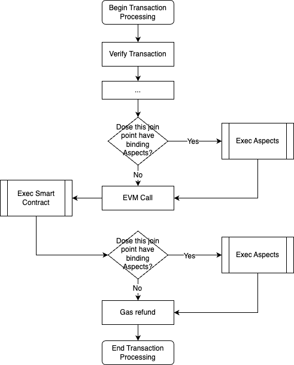

---
sidebar_position：3
---

# 方面编程

方面编程引入了围绕联接点模型（JPM）构建的强大范式。 该模型以三个关键组成部分为中心：

- **JOINPOINT** ：这表示将执行方面的位置。 它代表了交易和阻止处理流中的特定时刻，作为引入其他功能的钩子。

- **方面** ：这定义了将在联接点执行的代码。 一个方面可以利用运行时上下文并执行系统调用，这使其可以成为事务生命周期的活跃参与者。

- **结合** ：这概述了何时执行方面。 智能合同创建者可以将各个方面绑定到其智能合约中的某些联接点。 当交易处理与这些点保持一致时，相关的方面被激活。

  

为了说明方面编程的运作方式，请考虑一份智能合约，该合同设有大量存款。 目的是在运行时保护智能合约，从而使其免受可能非法重定向存款的潜在威胁。 一个方面的架构是监督和验证智能合约执行后保险库中的任何更改。 如果检测到基金运动的异常，则此方面将无疑的交易无效。 当交易调用合同时，在智能合同执行后启动此方面的执行。

## 方面并加入点

一个方面被设计为班级，是基础方面界面的扩展。 它包含指示联接点的方法，其中添加的逻辑可以交织在一起。 这是一个精致的例子：

<！ -  @formatter：off->
```typescript

class Aspect implements IPostTxExecuteJP {
    /**
      * postTxExecute is a join-point invoked post the completion of transaction execution but prior to state commitment.
      *
      * @param ctx context of the designated join-point
      * @return outcome of the Aspect's execution
      */
    postTxExecute(input: PostTxExecuteInput): void {
        if (ethereum.parseMethodSig(ctx.tx.content.data) == ethereum.computeMethodSig('withdraw')) {
            const withdrawAmount = ... // extract withdraw amount from calldata via context.tx.content.data
            const vaultBalance = new VauleState(ctx, ctx.tx.content.to).get('vauleBalance').current(); // state change wrapper class generated by aspect-tool
            if (vaultBalance != withdrawAmount) {
                sys.revert('Error: Balance discrepancy detected.');
            }
        }
    }
}
```
<！ -  @formatter：on->>

在上面的示例中，`postTxExecute` 方法充当通往联接点的门户，一旦EVM结束了交易，就可以发挥作用。

这 `PostTxExecuteCtx` 对象表示运行时上下文，为原始交易及其在当前联接点上的细微差别提供见解。 它传递给了联接点方法，从而促进了其与正在进行的交易的互动。

插图方面检查智能合约的调用 `withdraw` 交易期间的功能。 如果被调用，则将交易参数的预期提款金额与保险柜的实时基金流进行了交叉检查。 差异，指示编码错误或恶意攻击，促使该方面激活 `revert()` 从运行时上下文的事务管理对象发出的功能，从而消除了交易。

## 部署和约束力

为了将方面吸收到区块链中，其字节码嵌入到部署交易中。 该交易与方面系统合同相互作用，将该方面的字节码放在区块链的全球状态内。 这使验证者访问了字节码，从而允许在激活时执行该方面的逻辑。

但是，在绑定到特定的智能合约时，一个方面只会采取行动。 它要求智能合约所有者使用其外部账户（EOA）签署具有约束力的交易 - 该帐户应绕过对智能合约的检查 `isOwner(address) returns (bool)` 方法。 该交易既包含智能合约地址和方面ID，又涉及执行后的方面系统合同，巩固了智能合约与区块链全球状态内的债券之间的债券。 这样可以确保只有智能合同的合法所有者才能约束方面，从而挫败任何未经授权的约束力。

在部署和约束交易的成功执行后，该方面集成到区块链中并绑定到智能合约，扩大合同的功能并加强其安全性。

## 执行方面

每当智能合约以交易为目标时，就会激活方面编程框架运行时。 当交易开始时，运行时的方面评估了每个联接点，将任何链接的方面辨别到被调用的智能合约。 如果找到匹配项，则在交易执行后触发该方面。

为了执行该方面，其字节码从区块链的全局状态中获取，并引入WebAssembly（WASM）运行时环境。 然后构成一个详细介绍交易及其环境的上下文对象。 这为在运行时设定了阶段，以调用该方面的主要功能，从而促使其逻辑执行。

例如，考虑一个 `withdraw` 智能合约中的功能，旨在确保基金转移始终超过功能参数中规定的数量。 如果一个方面绑定到 `postTxExecute` 加入点，一旦交易结束，它就会被激活。 该方面运行时检索字节码，在WASM环境中启动它，创建上下文对象，并调用该方面的主要函数。 如果该方面检测到基金转让中的任何差异，它可以通过联接点上下文标记逆转。 在识别此标志的情况下，运行时间将交易恢复，将其标记为不成功，并提供了理由，指出由于链接的方面，交易被推翻了。

## 概括

方面编程框架的核心是联接点模型（JPM）。 该模型在交易和阻止处理序列中提供了战略性插入点，为补充逻辑铺平了道路。 体现此添加逻辑的方面可以利用运行时上下文并进行系统调用，将自己编织到交易的生命周期中。 通过将各个方面的结合到指定的联接点，智能合同所有人可以扩大功能并加强合同的安全性。

随后的部分将更深入地研究联接点模型的复杂设计及其实现。