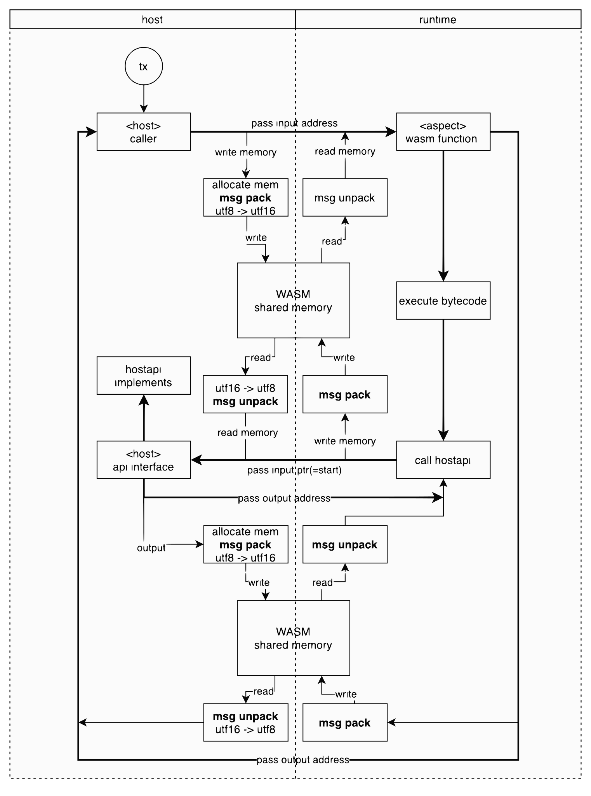

---
sidebar_position：5
---

# 方面运行时间

该方面运行时是专业的WASM虚拟机，量身定制用于执行方面的工程。 它的初始版本使用 [wasmtime](https://github.com/bytecodealliance/wasmtime) 这是在Rust制作的强大而迅速的WebAssembly实现。

核心WASM VM和区块链系统模块之间的桥梁，该方面运行时集成了一组主机API。 这些经过精心策划，以通过交互式功能增强方面的能力，从而确保与区块链系统模块的无缝通信。

## 工作流程

为了更好地了解运行时如何执行方面及其与区块链系统模块的通信方式的机制，请考虑以下图：

  

WASM和主机之间的数据交换导管是一组有限的主机API。 主机和WASM VM都利用了由方面运行时管理的共享内存空间来建立通信。 尽管WASM和主机之间的当前消息传输协议依赖于原始缓冲区编码，但我们还探索了二进制格式以进一步最小化开销。

## 隔离

该方面运行时被认为是沙盒环境。 方面的每个执行都会实现新的运行时，以确保每个方面操作保持隔离。 因此，方面执行期间的任何异常仅影响其状态，留下其他模块，智能合约和不受影响的方面。

## 气体

方面执行并非免于汽油成本。 在将方面集成到您的DAPP中可能会引入一些其他开销，但请放心，我们的重点仍然放在优化这些成本上。

阐明气体机制：

1. 汽油成本主要代表程序执行所需的CPU时间。 作为参考，CPU执行中的1秒相当于以太坊的1000万天气。
2. 以太坊已经精心衡量了特定OP代码所需的CPU周期，并为每个CPU循环分配了合理的气体成本。

在Artela中，为了确保与EVM既定的天然气系统的无缝集成，运行时间采用以太坊的假设（ `1 CPU Sec == 1 million gas` ）。 值得注意的是，该方面运行时的性能显着超过了EVM（吹嘘256位计算的10倍边缘。有关综合数据，请在我们的第8.1节中咨询我们的第8.1节 [白皮书](https://github.com/artela-network/aspect-whitepaper/blob/main/latex/build/whitepaper.pdf) ）。 结果，与方面相关的汽油费用在实施类似逻辑时与EVM合同相比，可能会降低10x〜100倍。

我们仍在完善特定的气体规则，并确保本节一旦完成后进行更新。