---
sidebar_position：8
---

# 结合

绑定是基于方面发展的重要过程。 只有在某些联接点绑定到特定的智能合约时，才能在某些联接点上触发一个方面。 EOA也可以与方面结合，方面可以为EOA提供自定义的交易验证过程。

## 步骤

  

1. **启动结合** ：帐户所有者通过使用其外部账户（EOA）签署绑定交易来启动绑定过程。
2. **合同所有权验证（仅合同帐户需要）** ：方面核心系统合同调用 `isOwner(address) returns (bool)` 智能合约的方法来验证发件人的地址。 如果验证失败（例如，由于未完成的验证方法或地址验证失败），则将恢复绑定事务。
3. **方面津贴检查** ：经过成功的合同所有权验证，`onContractBinding(address) bool` 给定方面的方法称为。 这检查当前的智能合约是否可以与给定方面结合。 如果此验证失败，则交易将被恢复。
4. **最终化结合** ：如果所有检查通过，则方面核心系统合同将关系保存在全球状态。 随后，当调用智能合约时，该方面将在指定的联接点上触发。

：：：笔记
只有在部署了给定版本和智能合约的给定版本时，才能建立绑定关系。 您不能与不存在的方面或智能合约约束。
:::

## 合同所有权验证

为了支持与某个方面的约束，智能合约必须实施 `isOwner(address) returns (bool)` 方法。 此方法对于验证智能合约的所有权至关重要。 如果该方法未能调用或返回错误，则绑定交易将无法成功。 在此方法中实现自定义逻辑可以进行更复杂的所有权验证，例如多签名验证。

## 合同地址验证

方面有能力拒绝某些合同的约束力。 这 `onContractBinding(address) bool` 当智能合约试图与该方面结合时，将调用钩子。 如果此方法返回false或未实现，则绑定事务将失败。 为了将您的方面限制为某些合同，您可以在此方法中实现白名单检查。 另外，对于公共可访问性，只需返回true即可。

## 优先事项

绑定请求中的优先级是无符号的8位整数。 它确定了方面执行的顺序，其方面的优先级最低，首先要执行。 如果多个方面具有相同的优先级，则最早的绑定时间的优先级将首先执行。

  

## 方面号码限制

帐户可以绑定的最大方面数为255，但在方面类型上有所不同。 此处的特殊情况是交易验证者方面，如果您将此类方面绑定到合同帐户，则只能绑定每个帐户的一个方面。