---
sidebar_position：9
---

# 方面与智能合约之间的沟通

尽管方面和智能合同执行环境是不同的（WASM与EVM），但并非完全孤立。 正如智能合约可以通过合同呼叫进行交互一样，有几种方面和智能合约来交换信息的方法。 本文档详细介绍了这些方法。

## EVM静态呼叫者

内置的EVM呼叫者在“方面框架”中有助于从方面到智能合约的单向通信。 在方面，您可以使用EVM呼叫者在只读模式下启动智能合约方法。 该方法被调用后，将根据最新规范块（当前版本不支持历史状态）的状态执行该方法，并将同步将结果返回到该方面。 这是一个示例的代码段：

```typescript
// Construct and dispatch contract call
const callMsg = new EthMessage(to, callData);
const res = sys.evm.staticCall(ctx).submit(callMsg);
// Examine for errors and retrieve return data
sys.require(res.vmError == '', res.vmError);
const retData = res.ret;
// Process the returned data...
```

：：：笔记
注意：静态呼叫者目前受到限制在合同呼叫级别联接点上使用。 它仅在交易或块级别联接点上起作用。
:::

## EVM JIT呼叫者

JIT呼叫允许方面通过 [帐户抽象](jit-call#understanding-account-abstraction) 钱包。 要深入了解JIT电话，请参考我们的 [文档](jit-call).

## 方面上下文

方面上下文是通过方面和智能合约都可以访问的瞬态全球存储。 该键值商店根据智能合约的地址和该方面的ID隔离。 实体只能使用其唯一地址/ID修改上下文，但可以读取其他实体的数据。 此功能不仅有助于各个方面之间的信息交换，而且还可以在智能合约和方面之间进行交流。

这是与一个方面的方面上下文互动的方法：

```typescript
// Fetch the context value from the Aspect storage
const ctxKey = ctx.aspect.transientStorage.get<string>('key');
// Extract and utilize the context value
const ctxValue = ctxKey.unwrap();
// Replace the key with a new value
ctxKey.set<string>('new-value');
```

并在智能合同中进行互动：

```solidity
// Invoke 0x64 with the ABI-encoded address and key to retrieve the raw byte value of the key
(bool success, bytes memory returnData) = address(0x64).call(abi.encodePacked(addr, key));
// Invoke 0x66 with the ABI-encoded key and value to store the values in the context
(bool success, ) = address(0x66).call(abi.encode(key, value));
```

上面的代码段可以在方面和智能合约之间读取和编写共享上下文，如果我们使用图表显示其工作原理，则将是这样的：

  