---
sidebar_position：11
---

# jit（及时）电话

方面提供了在其他呼叫之前或之后立即执行EVM呼叫的能力。 此功能称为 **正义（JIT）电话**。 它允许DAPP做出实时呼叫级决策。 例如，用户可以利用方面来监视DEX合同中某些符号的价格。 如果价格下降到一定交易后的指定门槛以下，则方面可以立即提交买入电话。

## 如何打电话打电话？

您可以使用以下代码启动JIT调用：

```typescript
import { sys } from "@artela/aspect-libs";

// ...
// Construct a JIT request (similar to the user operation defined in EIP-4337)
let request = new JitInherentRequest(
    walletAddress,        // The account initiating the operation
    nonce,                // Anti-replay parameter
    initCode,             // The initCode of the account (necessary only if the account is not yet on-chain and needs to be created)
    calldata,             // The amount of gas to allocate to the main execution call
    callGasLimit,         // The amount of gas to allocate for the verification step
    verificationGasLimit, // The amount of gas to compensate the bundler for pre-verification execution, calldata, and any untrackable gas overhead on-chain
    maxFeePerGas,         // Maximum fee per gas (similar to EIP-1559 max_fee_per_gas)
    maxPriorityFeePerGas, // Maximum priority fee per gas (similar to EIP-1559 max_priority_fee_per_gas)
    paymasterAndData,     // Address of the paymaster sponsoring the transaction, followed by extra data to send to the paymaster (empty for self-sponsored transactions)
);
// Submit the JIT call
let response = sys.evm.jitCall(ctx).submit(request);
// Verify successful submission of the call
sys.require(response.success, 'Failed to submit the JIT call');
// ...
```

：：：笔记
请注意：要启动JIT呼叫，呼叫的发件人必须是一个支持方面的AA钱包。 有关AA的详细信息和启用AA钱包的详细信息，请查看其中的内容 [以下各节](#understanding-account-abstraction).
:::

上面的代码触发以下顺序：

  

1. 在方面启动JIT调用将相应的请求发送到位置框架内的JIT呼叫者系统模块。
2. JIT呼叫者将请求封装到用户操作中，并将其转发到AA入口点。
3. AA入口点使用发件人的AA钱包验证用户操作。
4. 如果发件人的AA钱包支持方面验证，它将启动对预先编译合同的验证请求 `0x65` 在Artela EVM中。
5. 成功验证后，将JIT呼叫集​​成到EVM Callstack中。

：：：笔记
请注意，如果验证不成功（例如，由于气体不足）或发件人的AA钱包缺乏方面验证支持，则JIT呼叫可能会失败。 确保在您的方面代码中处理这些方案。
:::

## 了解账户抽象

Account Axpraction通过使用户能够将高级安全功能和改进用户体验直接纳入其帐户，为解决常见问题提供了多功能方法。 要深入了解帐户抽象，请考虑探索 [以太坊关于该主题的文章](https://ethereum.org/en/roadmap/account-abstraction/)，提供有价值的见解。

Artela在地址中包括一个内置的AA（帐户抽象）入口点 `0x000000000000000000000000000000000000aaEC`。 我们鼓励您尝试此AA入口点并创建独特的AA钱包。

：：：笔记
请注意，Artela的入口点仍是实验性的（因为EIP4337尚未在以太坊社区中采用）。 基础合同将被主动更新，以引入更多功能并解决安全问题。 使用此功能时谨慎行事。
:::

## 与AA钱包的整合

在交易执行期间，方面有能力通过AA钱包启动即时呼叫。 但是，此功能要求AA钱包与方面验证兼容。 如果您打算将对AA钱包的控制权委托给一个方面，则可以验证该方面发件人。 这是通过利用部署的预编译的智能合约来实现的 `0x65`。 这是一个过程：

```solidity
// Call 0x65 with the user operation hash
(bool success, bytes memory returnData) = address(0x65).call(bytes32ToBytes(userOpHash));
// Validate the return aspect id against your whitelist
// Note: This is a basic method to verify the JIT call. 
//       You may need to implement your customized validation logic based on your requirements.
validationData = success
? _validateAspectId(bytesToAddress(returnData))
: ASPECT_VALIDATION_FAILED;
```

预先编译合同 `0x65` 返回给定用户操作哈希的相应方面的地址。 这使您可以确定用户操作是否是由批准列表中的一个方面启动的。