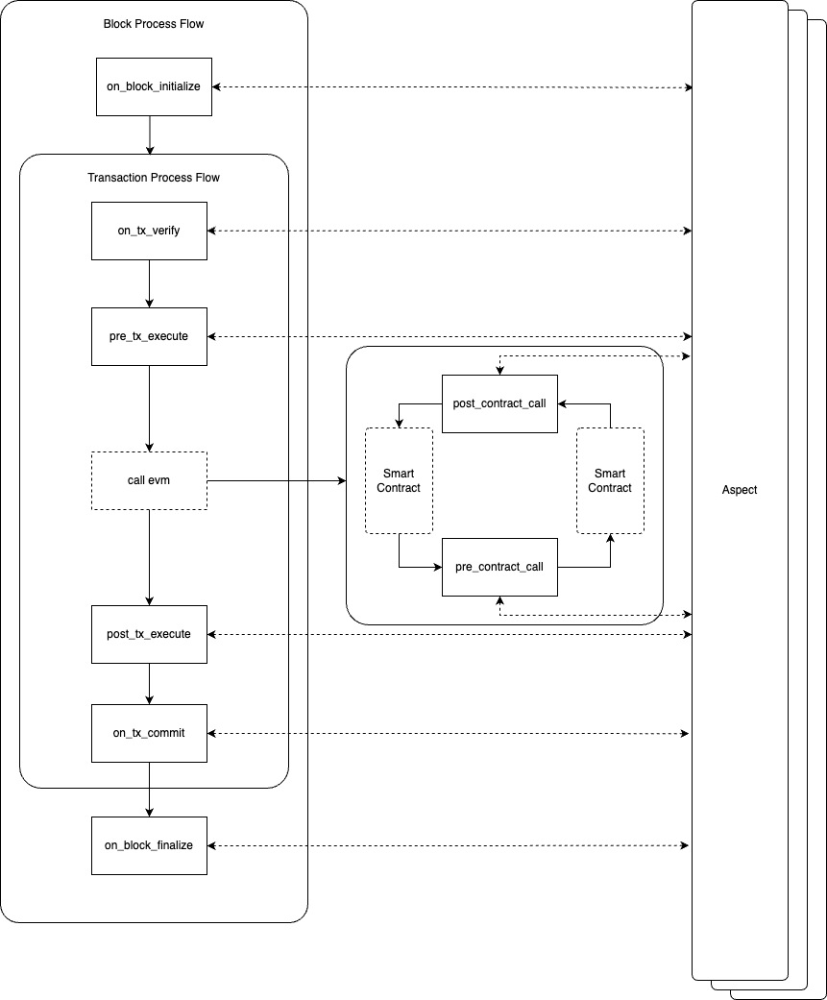

---
sidebar_position：7
---

# 加入点

每个联接点表示在特定交易生命周期阶段的特定状态过渡函数。 这些加入
点是由不同的元数据构建的（概述了触发条件，它可以访问的系统模块，
以及它可以利用的运行时上下文）和一个入口点函数（您的方面类中的一种方法，用于
实例，`PreTxExecute` ）。

联接点分为：

- **块级联接点** ：由由区块链自动生成的新块事件发起。
- **交易级别的联接点** ：由EOA交易激活。
- **呼叫级别的联接点** ：由合同互动发起。 值得注意的是，交叉合同相互作用也激活
这些加入点。

有关更多视觉表示形式，请参阅以下图：

  

## 入口点功能

每个联接点都有一个专用的入口点功能接口，该函数界面包括：

- 唯一功能名称
- 相关输入参数
- 预期输出

要使一个方面在联接点内保持活动状态，它必须包含一个与给定的输入函数对齐的函数，
通过各自的进入功能启动该方面。

  

## 互操作性接口

互操作性接口在：

- 读写运行时上下文
- 访问基础层模块

通过访问这些接口，方面可以利用核心区块链功能。 一些联接点可能会提供多个
系统调用。 这些界面使方面可以量身定制交易或阻止处理流。

  

## 布局

  

在方面编程中，各个块和交易的生命周期都定义了各种联接点。 这个框架
授权方面开发人员为DAPP创建自定义增强功能。

每个联接点的全面概述：

|加入点|描述|
|-------------------|---------------------------------------------------------------------------------------------------------------------------------------------------------------------------------------------------------------------------------------------------------------------------------------------------------|
|FilterTx|当RPC服务器接收此事务时，请注意，请注意，此联接点是外部共识，因此不允许在此处修改方面状态。|
|Ontxverify|当验证事务签名时触发，方面可以用自定义验证逻辑替换内置的SECP256K1签名验证。|
|Onblockinitialize|在制备块提案之前已激活。 此时允许插入自动交易。|
|presxececute|在交易执行之前触发。 在此阶段，帐户状态仍然是原始的，可以根据需要进行预加载信息。|
|预合同|在执行交叉合同呼叫之前触发。 例如，在TX执行期间，UNISWAP合同呼叫制造商合同，该方面将被执行。|
|订婚后|在执行交叉合同呼叫后触发。 然后，该方面可以检查合同的通话后状态，并做出后续执行决定。|
|txexecute|一旦执行交易并完成了账户状态，就被激活了。 随后，方面可以对最终执行状态进行全面审查。|
|OntxCommitt|交易完成后触发，并已将交易引起的修改状态刷新到状态数据库中。 在此阶段，方面可以进行后处理活动，例如启动可以在将来的障碍中执行的异步任务。|
|OnBlockFinalize|块后触发。 它允许该方面提交一个可以在将来的块中执行的异步任务。|

值得注意的是加入点提供了一个抽象的定义，适合各种区块链实现，不同的加入
点曝光和其他特定于平台的属性。

## 语境

运行时上下文提供了有关交易和块处理的重要见解，包括智能合约状态
更新，记录事件和交易原始数据。

上下文设计为钥匙值对集合，当某个方面查询A
具体键。 例如，查询 `tx^content^nonce` 将返回初始的NONCE场值
交易。 为了维持共识机制的一致性和一致性，区块链网络中的所有节点都必须
为块内的特定交易键提供统一值。

### 上下文子集

上下文包括四个主要类别：

- **块信息** ：不变的块细节，例如其哈希或验证器签名。
- **交易数据** ：与静态事务相关的数据，例如输入数据，收据和状态变化
交易执行。
- **方面可修改的数据** ：数据可以修改的数据，每个方面都在其名称空间内运行，确保
这些数据修改与其他方面没有重叠。
- **环境数据** ：与节点相关的环境变量，包括网络配置。

### 上下文生命周期

上下文的寿命仅限于块的处理持续时间。 当块启动处理时，每个交易
在该块中有新的环境，外壳特定的细节并确保交易期间的统一性
执行。

在块处理结论后，上下文终止。 了解这种终止不是很重要的
影响区块链状态或交易结果，均永久存储在区块链上。 上下文主要是
持有临时数据，以帮助交易流程并维护一个块内的状态统一性。