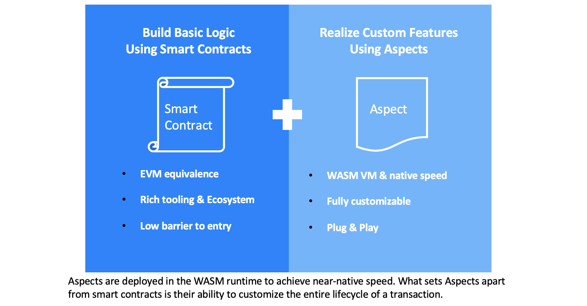

# 以Artela为基础

### EVM兼容
Artela是一个完全兼容EVM的区块链，使您可以无缝地从其他与EVM兼容的链中迁移DAPP。 您还可以在没有任何问题的情况下以坚固，VYPER和其他支持EVM的语言编写智能合约。

请注意，当前支持的坚固性版本是 `<= 0.8.21`.

有关更多详细信息，请参阅
*[EVM兼容性](/develop/core-concepts/evm-compatibility) 

### 超越EVM

Artela区块链定义了一个新的可编程模块，可作为本机扩展，称为“方面”。 方面整合了整个交易生命周期中的自定义功能，与智能合约协同工作以增强DAPP功能。

  

您可以在EVM智能合约中维护核心逻辑，并以插件的方式使用汽油效率和计算功能强大的WASM运行时实现自定义功能。

Artela方面的初始版本是由 [汇编脚本](https://www.assemblyscript.org/) （一组打字稿，严格键入）。

<！ - 名称为“方面”的灵感来自于方面的编程。 方面可以利用基本层的完整API集，并在事务生命周期期间将扩展逻辑注入特定的联接点。 - >

有关更多详细信息，请参阅：

*[方面编程](/develop/core-concepts/aspect-programming) 
*[方面](/develop/core-concepts/aspect) 
*[方面运行时间](/develop/core-concepts/aspect-runtime) 
*[方面生命周期](/develop/core-concepts/lifecycle) 

<！ -
## EVM兼容

Artela完全兼容EVM。 这意味着您可以使用Artela部署和运行以坚固性，Vyper和其他EVM兼容语言编写的智能合约，而没有任何问题。

 ***以太坊兼容性：** artela可以运行类似于以太坊区块链上的智能合约。 它使用相同的智能合同编程语言（例如坚固性），并支持类似于以太坊的交易和智能合同执行模型。

 ***跨链互操作性：** artela可以与以太坊实现互操作性。 这使用户可以在不同的EVM兼容区块链之间转移资产或执行智能合约，而无需复杂的转换或中介机构。

 ***开发人员生态系统：** artela通常会吸引以太坊开发人员，因为他们可以重复使用已经创建的智能合约和工具，从而将其应用程序扩展到不同的区块链上。

 ***协议标准：** artela通常遵循类似的协议标准，以确保兼容性。 这包括ERC-20（令牌标准），ERC-721（不可杀死的令牌标准）和其他以太坊改进建议（EIPS）等标准。

 ***互操作性和生态系统：** artela可以更轻松地与以太坊的Defi（分散财务）应用，DAPP（分散应用程序）和其他项目集成，从而扩大了整个以太坊生态系统。

总而言之，EVM兼容代表与以太坊的兼容性，提供了更大的互操作性和灵活性，以促进分散应用和跨链操作的发展。 这种兼容性对于整个区块链生态系统的生长和相互连接至关重要。 - >

<！ -
## 智能合同与方面

在Artela中，我们定义了一个新的可编程模块，可作为本机扩展，称为“方面”。

“方面”的名称受到面向方面的编程的启发。 方面可以利用基本层的完整API集，并在事务生命周期期间将扩展逻辑注入特定的联接点。

方面将自定义功能集成到区块链基层中，并与智能合约协同工作，以增强DAPP模块化和功能。

有关更多详细信息，请参见：

*[方面编程](/develop/core-concepts/aspect-programming) 
*[方面](/develop/core-concepts/aspect) 
*[方面运行时间](/develop/core-concepts/aspect-runtime) -->
