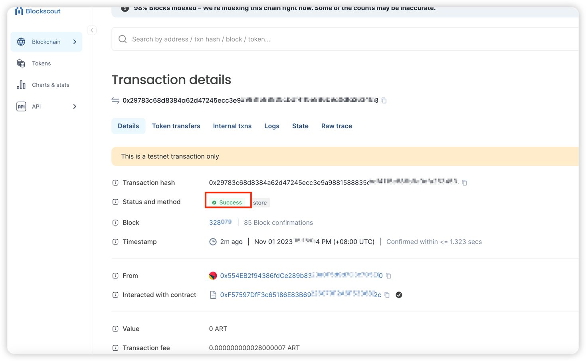

# Develop a Smart Contract

## Intro
Below is an example that use [@artela/aspect-tool](/develop/reference/aspect-tool/overview) to deploy storage contract to Artela TestNet.

**Pre-requisites:**
* [Node.js](https://nodejs.org/)
* [solc](https://docs.soliditylang.org/en/v0.8.20/installing-solidity.html)


## 1. Setting up a new project
Make sure you have a recent version of [Node.js](https://nodejs.org/) and npm installed,
Start by installing the `aspect-tool`:

```bash
npm install -g @artela/aspect-tool
```

**Project Initialization**, to kick off your project with `aspect-tool`, follow these steps:

```bash
# Create a new directory and navigate into it
mkdir storage-demo && cd storage-demo

# Set up the npm project with aspect-tool 
aspect-tool init

# Install the necessary dependencies
npm install
```

This will create a project directory with the following structure:

```
.
├── README.md
├── asconfig.json
├── aspect                   <-- Your aspect code resides here
│   └── index.ts       <-- Entry functions for the aspect
├── contracts                <-- Place your smart contracts here
├── package.json
├── project.config.json
├── scripts                  <-- Utility scripts, including deploying, binding and etc.
│   ├── aspect-deploy.cjs
│   ├── bind.cjs
│   ├── contract-call.cjs
│   ├── contract-deploy.cjs
│   ├── contract-send.cjs
│   └── create-account.cjs
├── tests
└── tsconfig.json

```

## 2. Create a Smart Contract

Within the `contracts` directory of your project, create your smart contract source files with a `.sol` extension.

#### 2.1.1. create a `Storage.sol` file

```solidity
// SPDX-License-Identifier: GPL-3.0

pragma solidity >=0.8.2 <0.9.0;

/**
 * @title Storage
 * @dev Store & retrieve value in a variable
 * @custom:dev-run-script ./scripts/deploy_with_ethers.ts
 */
contract Storage {

    uint256 number;

    /**
     * @dev Store value in variable
     * @param num value to store
     */
    function store(uint256 num) public {
        number = num;
    }

    /**
     * @dev Return value 
     * @return value of 'number'
     */
    function retrieve() public view returns (uint256){
        return number;
    }
}


```


## 3. Compile the Smart Contract


This step relies on `solc`, first check if [solc](https://docs.soliditylang.org/en/v0.8.20/installing-solidity.html) is installed correctly

```bash
 npm install -g solc
 
 solc --version
```

Compile your contract using:

```bash
npm run contract:build
```

> ✅ Successful compilation will generate some `*.abi`  files in the `build/contract` directory.


## 4. Deploy the Smart Contract

### 4.1 Update project.config.json

Update the `project.config.json` in the root directory with the appropriate network configuration:
```json
{
  "node": "https://betanet-rpc1.artela.network"
}
```
:::note 💡
For more details regarding development environment setup, please refer to [artela devnet](/develop/node/access-testnet)
:::

#### 4.2 Create a blockchain account (optional).

Execute the following command under the `storage-demo` folder to create an account if you haven't already done so:

```bash
// create  deployer

npm run account:create

```

> * --skfile : privateKey path for sender. (optional, default value: `./privateKey.txt`).

If your account lacks test tokens, join [Discord](https://discord.com/invite/artela)，and request some in `testnet-faucet` channel.


### 4.3  Deploy your contract

Execute the following command within the `storage-demo` folder, using the provided script:

```bash
npm run contract:deploy -- --abi ./build/contract/Storage.abi \
                           --bytecode ./build/contract/Storage.bin                       
```


Upon successful deployment, the terminal will display the contract address.

## 5. Call Contract
Execute the following command within the `storage-demo` folder, call the Contract

### 5.1 Send transaction for store

```shell

npm run contract:send -- --contract {artToken-address} \
                         --abi ./build/contract/Storage.abi \
                         --method store \
                         --args 100
```


```bash
npm run contract:call -- --contract {artToken-address}  \
                         --abi ./build/contract/Storage.abi \
                         --method retrieve 

```

### 5.2 Check transaction

Confirm the successful on Artela TestNet [blockchain explorer](https://betanet-scan.artela.network/) using `transaction hash` in output.


