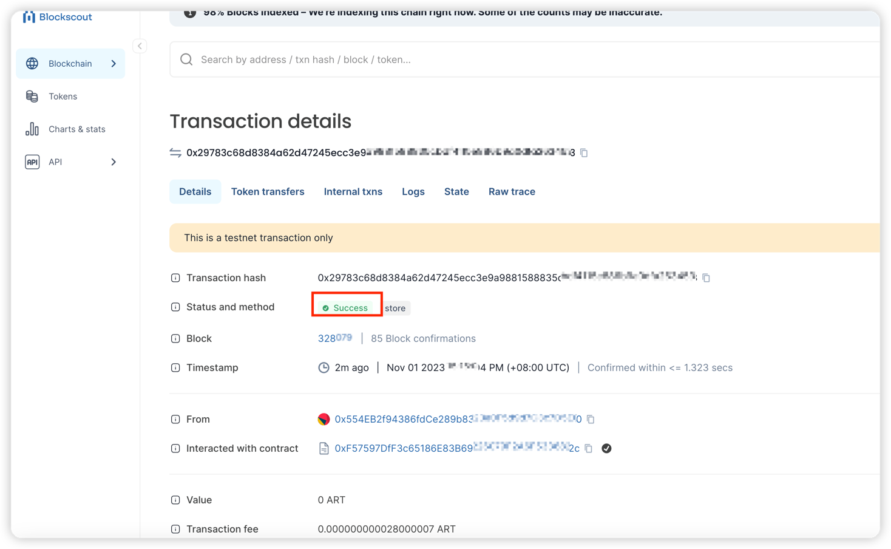

---
sidebar_position：1
---

# 制定智能合同

## 简介
以下是使用的示例 [@artela/fack-tool](/develop/reference/aspect-tool/overview) 将存储合同部署到Artela Testnet。

 **先决条件：** 
*[node.js](https://nodejs.org/) 
*[Solc](https://docs.soliditylang.org/en/v0.8.20/installing-solidity.html) 


## 1. 建立一个新项目
确保您有最近版本的 [node.js](https://nodejs.org/) 和NPM安装，
首先安装 `aspect-tool` ：

```bash
npm install -g @artela/aspect-tool
```

 **项目初始化**，启动您的项目 `aspect-tool`，请执行以下步骤：

```bash
# Create a new directory and navigate into it
mkdir storage-demo && cd storage-demo

# Set up the npm project with aspect-tool 
aspect-tool init

# Install the necessary dependencies
npm install
```

这将创建一个具有以下结构的项目目录：

```
.
├── README.md
├── asconfig.json
├── aspect                   <-- Your aspect code resides here
│   └── index.ts       <-- Entry functions for the aspect
├── contracts                <-- Place your smart contracts here
├── package.json
├── project.config.json
├── scripts                  <-- Utility scripts, including deploying, binding and etc.
│   ├── aspect-deploy.cjs
│   ├── bind.cjs
│   ├── contract-call.cjs
│   ├── contract-deploy.cjs
│   ├── contract-send.cjs
│   └── create-account.cjs
├── tests
└── tsconfig.json

```

## 2. 创建聪明的合同

在 `contracts` 项目目录，用一个创建智能合约源文件 `.sol` 扩大。

#### 2.1.1。 创建一个 `Storage.sol` 文件

```solidity
// SPDX-License-Identifier: GPL-3.0

pragma solidity >=0.8.2 <0.9.0;

/**
 * @title Storage
 * @dev Store & retrieve value in a variable
 * @custom:dev-run-script ./scripts/deploy_with_ethers.ts
 */
contract Storage {

    uint256 number;

    /**
     * @dev Store value in variable
     * @param num value to store
     */
    function store(uint256 num) public {
        number = num;
    }

    /**
     * @dev Return value 
     * @return value of 'number'
     */
    function retrieve() public view returns (uint256){
        return number;
    }
}


```


## 3. 编译智能合同


此步骤依靠 `solc`，首先检查是否 [Solc](https://docs.soliditylang.org/en/v0.8.20/installing-solidity.html) 正确安装

```bash
 npm install -g solc
 
 solc --version
```

使用以下方式编译合同：

```bash
npm run contract:build
```

> ✅成功的汇编将产生一些 `*.abi` 文件中的文件 `build/contract` 目录。


## 4. 部署智能合约

### 4.1 UPDATE Project.Config.json

更新 `project.config.json` 在Root Directory中，具有适当的网络配置：
```json
{
   "node": "https://betanet-rpc1.artela.network" 
}
```
:::注意💡
有关开发环境设置的更多详细信息，请参考 [Artela Devnet](/develop/node/access-testnet) 
:::

#### 4.2创建一个区块链帐户（可选）。

执行以下命令 `storage-demo` 如果您还没有这样做，则可以创建一个帐户：

```bash
// create  deployer

npm run account:create

```

> *  -  Skfile：发送者的私人关键路径。 （可选，默认值： `./privateKey.txt` ）。

如果您的帐户缺乏测试令牌，请加入 [不和谐](https://discord.com/invite/artela)，并要求一些 `testnet-faucet` 渠道。


### 4.3部署合同

执行以下命令 `storage-demo` 文件夹，使用提供的脚本：

```bash
npm run contract:deploy -- --abi ./build/contract/Storage.abi \
                           --bytecode ./build/contract/Storage.bin                       
```


成功部署后，终端将显示合同地址。

## 5. 致电合同
执行以下命令 `storage-demo` 文件夹，致电合同

### 5.1发送商店的交易

```shell

npm run contract:send -- --contract {artToken-address} \
                         --abi ./build/contract/Storage.abi \
                         --method store \
                         --args 100
```


```bash
npm run contract:call -- --contract {artToken-address}  \
                         --abi ./build/contract/Storage.abi \
                         --method retrieve 

```

### 5.2检查交易

在Artela Testnet上确认成功 [区块链资源管理器](https://betanet-scan.artela.network/) 使用 `transaction hash` 输出。

  