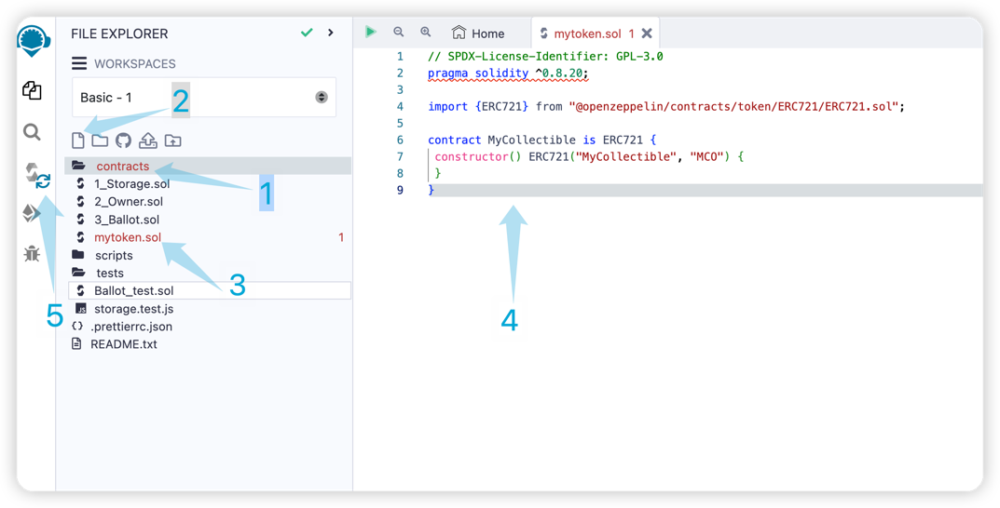
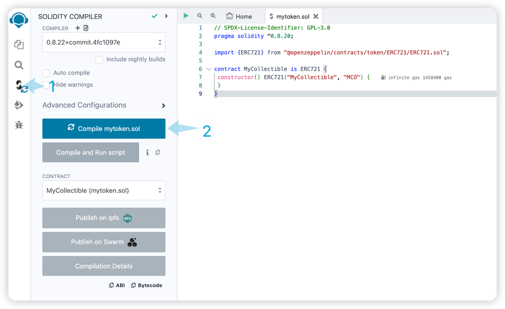
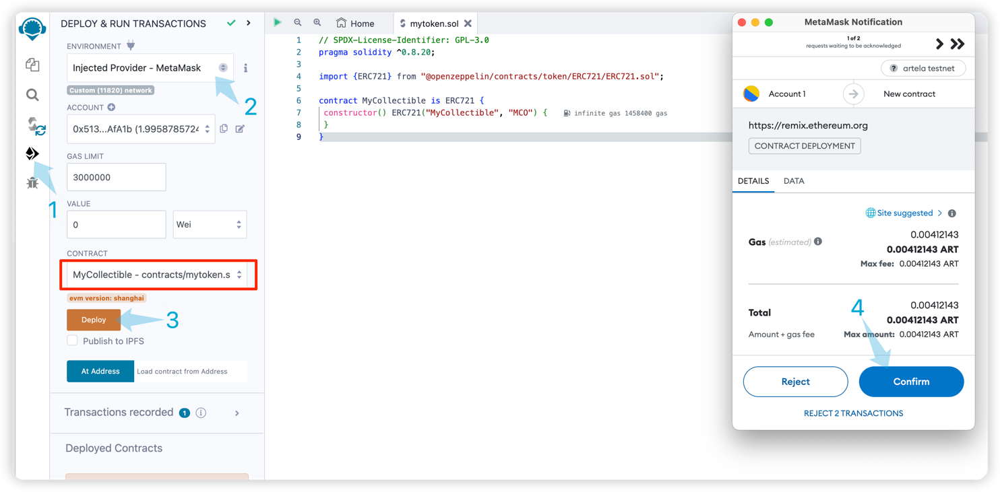
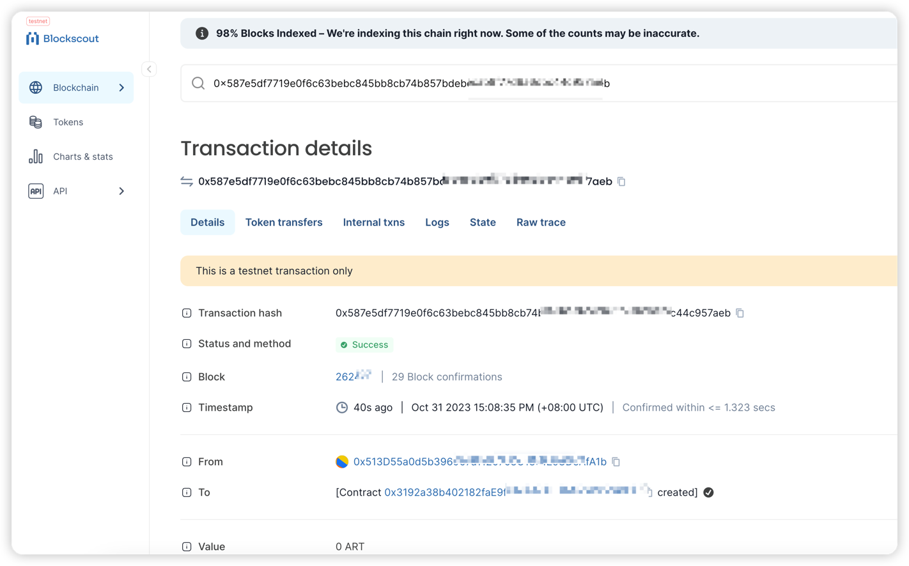

# 用混音开发

在本教程中，我们将带您完成使用Remix和MetAmask在Artela Testnet上创建和部署智能合约的过程。

## 先决条件
*[metamask](https://metamask.io/) 
*[混音](https://remix.ethereum.org/) 

## 1. 在混音中写一份智能合同

启动混音。 通过选择来为坚固开发配置混音 `SOLIDITY` 在下面 `Featured Plugins` 在主页上。 导航到 `File Explorers` 管理文件。

1. 打开 "contracts" 文件夹。
2. 创建新的合同文件。
3. 输入文件名 "mytoken.sol".
4. 复制合同mytoken.sol代码。
5. 点击 "solidity compiler" 并确保汇编成功。

  

 **固体编译器：** 
  


 **mytoken.sol：** 

```solidity
// SPDX-License-Identifier: GPL-3.0
pragma solidity ^0.8.20;

import {ERC721} from "@openzeppelin/contracts/token/ERC721/ERC721.sol";

contract MyCollectible is ERC721 {
 constructor() ERC721("MyCollectible", "MCO") {
 }
}
```

## 2. 连接到Artela testnet并部署

将混音连接到MetAmask并部署您的智能合约涉及一些直接的步骤：

*为Artela Testnet配置MetAmask：
*打开MetAmask并确保您连接到Artela Testnet。 如果未列出Artela TestNet，则可能需要手动添加它。[导航到网络设置并输入Artela TestNet详细信息。](/develop/guides/wallet-configuration) 
*将混音连接到metamask
*在混音处，在左侧，单击按钮 `Deploy and run transactions`。 设置环境是 `Injected Provider - MetaMask[2]` 
*部署您的智能合同
*通过连接MetAmask，您现在可以从Remix部署智能合约。
*编译您的合同代码，然后在混音中选择正确的合同。
*单击 `Deploy[3]` 按钮启动部署过程。
*确认元张中的交易
* metamask会提示您 `Confirm[4]` 部署交易。
*查看详细信息并确认交易。

  

## 3. Block Explorer

确认在Artela Testnet上成功部署 [区块链资源管理器](https://betanet-scan.artela.network/) 使用 `transaction hash` 输出。


  

恭喜！ 您已经成功创建并在Artela Testnet上部署了智能合约。 愉快的编码！