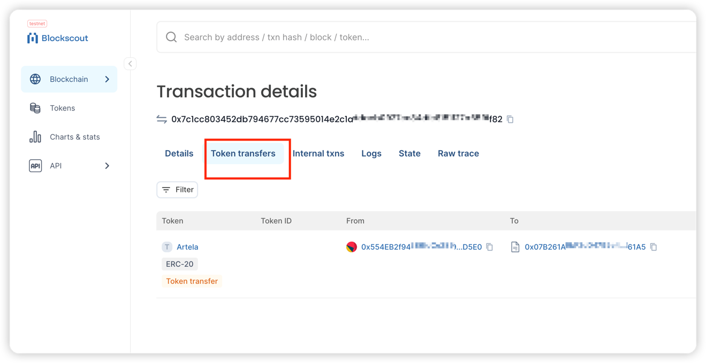

---
sidebar_position：2
---

# 在Artela中创建ERC-20令牌

## 简介
以下是使用的示例 `@artela/aspect-tool` 将ERC20合同部署到Atela Testnet。

 **先决条件：** 
*[node.js](https://nodejs.org/) 
*[Solc](https://docs.soliditylang.org/en/v0.8.20/installing-solidity.html) 


## 1. 建立一个新项目
确保您有最近版本的 [node.js](https://nodejs.org/) 和NPM安装，
首先安装 `aspect-tool` ：

```bash
npm install -g @artela/aspect-tool
```

 **项目初始化**，启动您的项目 `aspect-tool`，请执行以下步骤：

```bash
# Create a new directory and navigate into it
mkdir erc20-token && cd erc20-token

# Set up the npm project with aspect-tool 
aspect-tool init

# Install the necessary dependencies
npm install
```

这将创建一个具有以下结构的项目目录：

```
.
├── README.md
├── asconfig.json
├── aspect                   <-- Your aspect code resides here
│   └── index.ts       <-- Entry functions for the aspect
├── contracts                <-- Place your smart contracts here
├── package.json
├── project.config.json
├── scripts                  <-- Utility scripts, including deploying, binding and etc.
│   ├── aspect-deploy.cjs
│   ├── bind.cjs
│   ├── contract-call.cjs
│   ├── contract-deploy.cjs
│   ├── contract-send.cjs
│   └── create-account.cjs
├── tests
└── tsconfig.json

```

## 2. 创建聪明的合同

安装所需的依赖 `@openzeppelin/contracts` ：

```shell
npm install @openzeppelin/contracts
```

在 `contracts` 目录，用一个创建智能合约源文件 `.sol` 扩大。

### 2.1。 创建一个 `ArtToken.sol` 文件

```solidity
// SPDX-License-Identifier: GPL-3.0

pragma solidity ^0.8.9;

import "@openzeppelin/contracts/token/ERC20/ERC20.sol";
import "@openzeppelin/contracts/access/Ownable.sol";

contract ArtToken is ERC20, Ownable {
    constructor(uint256 initialSupply) ERC20("Artela", "ART")  Ownable(msg.sender){
        _mint(msg.sender, initialSupply);
    }
}
```

### 2.2。 创建一个 `Broker.sol` 文件（持有Arttoken）。

```solidity
// SPDX-License-Identifier: GPL-3.0
pragma solidity ^0.8.9;

import "@openzeppelin/contracts/token/ERC20/IERC20.sol";
import "@openzeppelin/contracts/access/Ownable.sol";

contract Broker is Ownable {
    address private deployer;
    address immutable _tokenIn;

    constructor(address mytoken) Ownable(msg.sender) {
        _tokenIn=mytoken;
        deployer = msg.sender;
    }

    function isOwner(address user) external view returns (bool result) {
        if (user == deployer) {
            return true;
        } else {
            return false;
        }
    }

    function startSchedule() public pure returns(bool)  {
        return true;
    }

    function transfer(address target,uint256 amount) public onlyOwner{
        require(amount > 0, "You need to sell at least some tokens");
        require(amount < IERC20(_tokenIn).balanceOf(address(this)) ,"Unable to afford sufficient amount");
        IERC20(_tokenIn).transfer(target,amount);
    }

    function allowance(address aspectId) onlyOwner external view returns (uint256 valueWei) {
        require(aspectId>address(0),"aspectId empty");
        //todo check aspectId
        return  IERC20(_tokenIn).balanceOf(msg.sender);
    }

}
```

## 3. 编译智能合同


此步骤依靠 `solcjs`，首先检查是否 [Solc](https://docs.soliditylang.org/en/v0.8.20/installing-solidity.html) 正确安装

```bash
 npm install -g solc
 
 solcjs --version
```

更新 `contract:build` 命令 `Package.json`。 使用 `solcjs` 建立合同。

```bash
{
   "contract:build": "solcjs --abi --bin --include-path ./node_modules/ --base-path . -o ./build/contract/  ./contracts/*.sol",
}
```

使用以下方式编译合同：

```bash
npm run contract:build
```

> ✅成功的汇编将产生一些 `*.abi` 文件中的文件 `build/contract` 目录。


## 4. 部署智能合约

### 4.1 UPDATE Project.Config.json

更新 `project.config.json` 在Root Directory中，具有适当的网络配置：
```json
{
   "node": "https://betanet-rpc1.artela.network" 
}
```
:::注意💡
有关开发环境设置的更多详细信息，请参考 [Artela Devnet](/develop/node/access-testnet) 
:::

### 4.2创建一个区块链帐户（可选）。

执行以下命令 `erc20-token` 如果您还没有这样做，则可以创建一个帐户：

```bash
// create ArtToken deployer
npm run account:create -- --skfile ./tokenPk.txt

// create Broker deployer
npm run account:create -- --skfile ./brokerPk.txt

```

> *  -  Skfile：发送者的私人关键路径。 （可选，默认值： `./privateKey.txt` ）。

如果您的帐户缺乏测试令牌，请加入 [不和谐](https://discord.com/invite/artela)，并要求一些 `testnet-faucet` 渠道。


### 4.3部署合同

执行以下命令 `erc20-token` 文件夹，使用提供的脚本：

```bash

npm run contract:deploy -- --skfile ./tokenPk.txt  \
                           --abi ./build/contract/contracts_ArtToken_sol_ArtToken.abi \
                           --bytecode ./build/contract/contracts_ArtToken_sol_ArtToken.bin \
                           --args 10000000
                           
                           
npm run contract:deploy -- --skfile ./brokerPk.txt  \
                           --abi ./build/contract/contracts_Broker_sol_Broker.abi \
                           --bytecode ./build/contract/contracts_Broker_sol_Broker.bin \
                           --args {ArtToken_Address}   
```


成功部署后，终端将显示合同地址。

## 5. 致电合同

### 5.1转移Arttoken到经纪地址
执行以下命令 `erc20-token` 文件夹：

```bash

npm run contract:send   -- --skfile ./tokenPk.txt \
                        --contract {artToken-address}  \
                        --abi ./build/contract/contracts_ArtToken_sol_ArtToken.abi \
                        --method transfer \
                        --args {broker-address} 100 \
                        --gas 200000


```

### 5.2检查交易

确认成功 `transfer` 在Artela Testnet上 [区块链资源管理器](https://testnet-scan.artela.network/) 使用 `transaction hash` 输出。

  