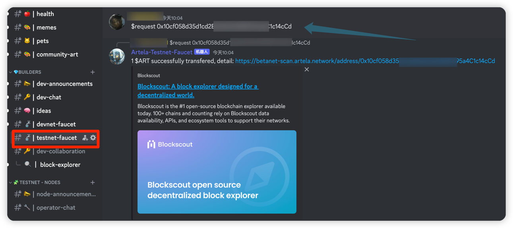

# 钱包配置

Artela是与以太坊虚拟机（EVM）兼容的区块链，它支持与所有钱包兼容
EVM。 这是使用的步骤 `MetaMask` 例如，配置网络并要求测试令牌：

## 先决条件

*[metamask](https://metamask.io/) 

## 1. 开放式元法

启动MetAmask扩展名或应用程序。

## 2. 将元张纸连接到Artela testnet

如果您是MetAmask的新手，请遵循本指南
在 [如何添加自定义网络RPC](https://support.metamask.io/hc/en-us/articles/360043227612-How-to-add-a-custom-network-RPC) 
有关详细说明。

小鸡 `Networks`>`Add a network`>`Add a network manually` 

```
Network Name : Artela TestNet
New RPC URL : https://betanet-rpc1.artela.network
ChainID (optional): 11822
Symbol (optional) : ART
Block Explorer URL (optional): https://betanet-scan.artela.network/
```

有关新RPC URL配置的更多信息，请参阅 [Artela Testnet](/develop/node/access-testnet).

确保正确填充所有字段：

  

## 3. 访问测试网龙头

加入Artela [Discord服务器](https://discord.com/invite/artela) 访问Testnet艺术水龙头。
请求访问并在您的钱包地址获得TestNet艺术。

```shell
$request {address}
```

  

完成这些步骤后，将您的元掩体配置为与Artela区块链进行交互，并且您在该网络上声称具有测试令牌。

## 4. 检查余额

  