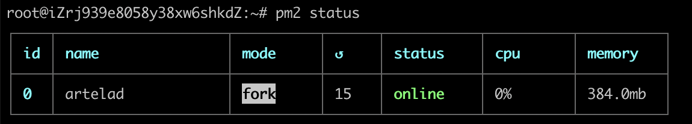
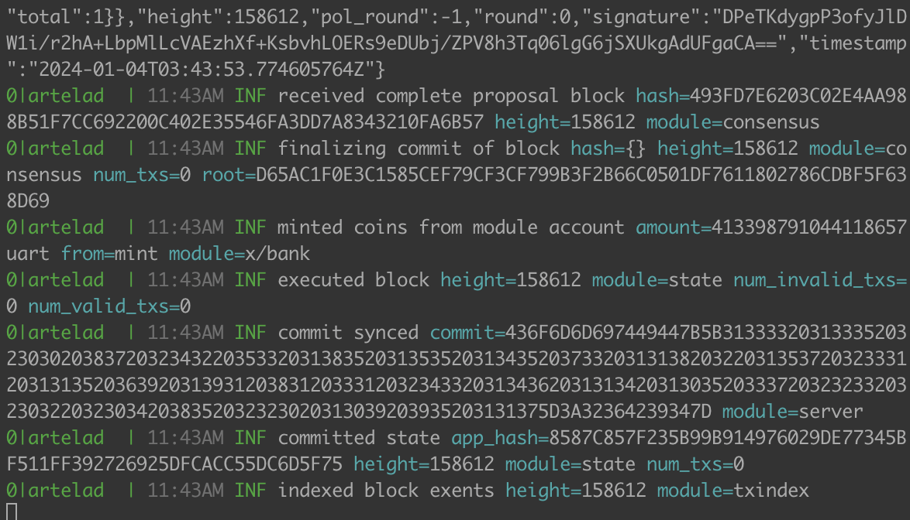

---
sidebar_position：1
---

# 运行一个完整的节点

该文档提供了将Artela Testnet作为完整节点加入的介绍。
> 建议使用 `ubuntu` 操作系统。

 **硬件推荐要求：** 

- 8个CPU核心

- 16GB内存

- 1TB SSD

- 200Mbps网络带宽

## 1. 准备Artelad

您可以从安装Artelad或构建源代码开始

### 选项1：构建源。

### 1）。 准备开发工具

 **跳过** 如果您已经有了GO开发环境，则可以。

```bash
sudo apt-get update
sudo apt-get install -y make gcc
wget https://go.dev/dl/go1.20.3.linux-amd64.tar.gz
sudo rm -rf /usr/local/go && sudo tar -C /usr/local -xzf go1.20.3.linux-amd64.tar.gz
export PATH=$PATH:/usr/local/go/bin
```

您需要创建一个文件夹来存储您的源文件，例如 `/home/user1/go/src`。 代替 `user1` 到您的帐户，例如 `ubuntu`.
```bash
mkdir -p /home/user1/go/src
```
然后，设置 `/home/user1/go` 用以下命令作为gopath：
```bash
export GOPATH=/home/user1/go
```
这样可以确保正确配置必要的GO环境变量。

### 2）。 克隆并构建代码

```bash
cd $GOPATH/src
git clone https://github.com/artela-network/artela
# git clone https://github.com/artela-network/artela-cosmos-sdk
# git clone https://github.com/artela-network/artela-cometbft
cd artela

git checkout main
make clean && make
cp ./build/artelad $HOME/go/bin/.
export PATH=$PATH:$HOME/go/bin
```

### 选项2：下载并安装Artelad

找到二进制 `artelad` 在Artela Network GitHub存储库中，[发布链接](https://github.com/artela-network/artela/releases).

复制二进制 `artelad` 到 `/usr/local/bin`.

## 2. 初始节点

 **1）。 init** 

```bash
artelad init <custom_moniker> # e.g artelad init test111
```

 **2）。 复制创世纪[创世记](./genesis.json)并移至主目录。** 

```bash
mv genesis.json $HOME/.artelad/config/genesis.json
```

 **3）。 配置** 

Get从中获得天赋的种子 [2.持续的节点](./access-testnet#public-information-on-testnet) 

将其中两个添加到 `seeds` 在 `config.toml` 

```bash
cd $HOME/.artelad/config
# e.g sed -i 's/seeds = ""/seeds = "ef1777650f2a5f96cfbf2b1b21feb45ef09bbaa4@172.16.10.2:26656,96a8e722f93acacd21baec6db51acd6cc16bbee2@172.16.10.4:26656"/' config.toml
sed -i 's/seeds = ""/seeds = "<node-id-1@node-1-ip:port>,<node-id-2@node-2-ip:port>"/' config.toml
```

## 3. 设置状态同步

```bash
cd $HOME/.artelad/config
sed -i 's/enable = false/enable = true/' config.toml
sed -i 's/trust_height = 0/trust_height = <BLOCK_HEIGHT>/' config.toml
sed -i 's/trust_hash = ""/trust_hash = "<BLOCK_HASH>"/' config.toml

# e.g sed -i 's/rpc_servers = ""/rpc_servers = "172.16.10.2:26657,172.16.10.4:26657"/' config.toml
sed -i 's/rpc_servers = ""/rpc_servers = "node-1-ip:port,node-2-ip:port"/' config.toml
```

Get得到 `BLOCK_HEIGHT` 和 `BLOCK_HASH` 从 [3.信任块和高度](./access-testnet#public-information-on-testnet) 

Get得到 `rpc_servers` 从 [4. RPC服务器](./access-testnet#public-information-on-testnet##RPC-servers) 

## 4. 推荐的配置
### 4.1 app.toml

：：：警告
建议您修改app.toml配置项与以下内容一致
:::
```toml
# app.toml
minimum-gas-prices = "0.02uart" 

pruning = "custom" 
pruning-keep-recent = 362880
pruning-interval = 100
pruning-keep-every = 0

[api]
enable = true
address = "tcp://0.0.0.0:1317" 

[grpc]
address = "0.0.0.0:9090" 

[grpc-web]
address = "0.0.0.0:9091" 

[state-sync]
snapshot-interval = 1000
snapshot-keep-recent = 10

[json-rpc]
address = "0.0.0.0:8545" 
```

### 4.2 config.toml
：：：警告
建议您修改config.toml配置项与以下
:::
```toml
# config.toml
proxy_app = "tcp://0.0.0.0:26658" 

[rpc]
laddr = "tcp://0.0.0.0:26657" 

[consensus]
timeout_commit = "500ms" 
```

## 5. 启动Artela节点

```bash
export PATH=$PATH:$HOME/go/bin

artelad start --log_level debug
```
 **可选：启动Artela节点作为背景服务** 

### 5.1在Ubuntu OS上安装PM2
```bash
sudo apt update
sudo apt install npm -y
sudo npm install -g n
n latest
hash -r

npm install pm2@latest -g
```

### 5.2启动Artela节点
```bash
pm2 start artelad -- start && pm2 save && pm2 startup
```

### 5.3检查状态
```bash
pm2 status
```
  

### 5.4检查日志
```bash
pm2 logs
```

当它与所有块同步时，输出看起来像：

  