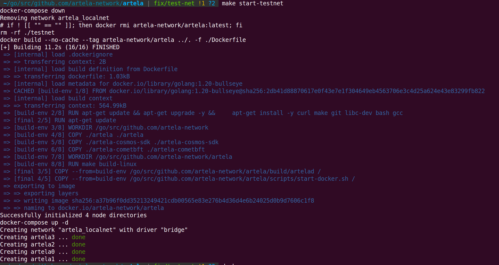

---
sidebar_position：2
---

# 设置本地DEVNET

本文档旨在指导您编译Artela代码，配置和生成由至少四个验证器组成的TestNet设置。 随后，我们将概述如何将这些配置和数据文件部署到四个单独的计算机上。

> 注意：打开26656和26657所有机器的端口。
>

## 1. 准备开发工具

 **跳过** 如果您已经准备好了开发环境，这是这样的。

```bash
sudo apt-get update
sudo apt-get install -y make gcc
wget https://go.dev/dl/go1.20.3.linux-amd64.tar.gz
sudo rm -rf /usr/local/go && sudo tar -C /usr/local -xzf go1.20.3.linux-amd64.tar.gz
# export PATH=$PATH:/usr/local/go/bin
```

您需要创建一个文件夹来存储您的源文件，例如 `/home/user1/go/src`。

然后，设置 `/home/user1/go` 用以下命令作为gopath： `go env -w "GOPATH=/home/user1/go"`。

这样可以确保正确配置必要的GO环境变量。

## 2. 克隆并构建代码

```bash
cd $GOPATH/src/github.com/artela-network
git clone https://github.com/artela-network/artela-cometbft.git
# git clone https://github.com/artela-network/artela-cosmos-sdk.git
# git clone https://github.com/artela-network/artela.git

cd artela
make clean && make
# find 'artelad' in ./build

# you can copy the binary to $GOPATH/bin
# this is unnecessary if your are going to run testnet in docker
make install
```

## 3. 您可以在Docker或4个设备中启动测试网

### 选项1：在Docker中启动4-Validator Testnet

### 1）。 准备您的Docker和Docker-Compose（Ubuntu/Debian）

```bash
sudo apt update
sudo apt install apt-transport-https ca-certificates curl software-properties-common
curl -fsSL https://download.docker.com/linux/ubuntu/gpg | sudo apt-key add -
sudo add-apt-repository "deb [arch=amd64] https://download.docker.com/linux/ubuntu focal stable" 

apt-cache policy docker-ce
sudo apt install docker-ce

sudo systemctl status docker
# check if docker is ready
docker run hello-world

# install docker-compose
sudo apt install docker-compose
```

### 2）。 启动TestNet

```bash

cd artela # in your artela root path
make create-testnet
```

  

- 更多的 `make` 关于testnet的选项：

|命令|描述|
| --- | --- |
|构建测试网|为TestNet构建Docker映像，并为4 VALIDATOR节点创建配置。|
|创建测试网|删除先前构建的测试网，使用构建测试网再次构建，然后启动Docker容器。|
|停止测试网|停止运行的Docker容器进行测试网。|
|启动测试网|启动先前停止的Docker容器以进行测试网。|
|删除测试网|停止Docker容器并删除由build-TestNet命令创建的所有组件。|

### 3）。 查看Artela节点的日志

日志保存在 `./_testnet/node0/artelad/node.log`，监视日志

```bash
tail -f ./_testnet/node0/artelad/node.log
```

其他节点的日志

 `./_testnet/node1/artelad/node.log` 

 `./_testnet/node2/artelad/node.log` 

 `./_testnet/node3/artelad/node.log` 

### 选项2：在您的设备中启动4-validator Testnet

### 1）。 生成4个validator网络配置

```bash
# in artela root
./build/artelad testnet init-files --chain-id artela_11822-1 --v 4 --output-dir ./testnet --starting-ip-address 172.16.10.2
```

配置：

- --chain-id

使用Artela _ \ <number \> 1的格式，数字可以是一种 **`11822`**，，，，**`11821`**.

- --v

验证者的计数。

- --output-dir

将生成验证器的配置的位置。

- --starting-ip-address

节点将根据IP地址从该起始地址按顺序递增的IP地址进行预分配。 例如，节点0将分配 `starting-ip-address`，节点1将被分配 `starting-ip-address + 1`，节点2将分配 `starting-ip-address + 2`， 等等。 随后，在节点配置中，将根据节点的IP地址设置persistent_peers。


### 2）。 更新每个节点的IP地址

在每个节点的 **`config.toml`**，更新下列出的同行的IP地址 **`persistent_peers`**。 您可以为此使用以下命令：

```bash
cd testnet
sed -i 's/172.16.10.3/<your-device-1-ip>/g' node0/artelad/config/config.toml
sed -i 's/172.16.10.4/<your-device-2-ip>/g' node0/artelad/config/config.toml
sed -i 's/172.16.10.5/<your-device-3-ip>/g' node0/artelad/config/config.toml

sed -i 's/172.16.10.2/<your-device-0-ip>/g' node1/artelad/config/config.toml
sed -i 's/172.16.10.4/<your-device-2-ip>/g' node1/artelad/config/config.toml
sed -i 's/172.16.10.5/<your-device-3-ip>/g' node1/artelad/config/config.toml

sed -i 's/172.16.10.2/<your-device-0-ip>/g' node2/artelad/config/config.toml
sed -i 's/172.16.10.3/<your-device-1-ip>/g' node2/artelad/config/config.toml
sed -i 's/172.16.10.5/<your-device-3-ip>/g' node2/artelad/config/config.toml

sed -i 's/172.16.10.2/<your-device-0-ip>/g' node3/artelad/config/config.toml
sed -i 's/172.16.10.3/<your-device-1-ip>/g' node3/artelad/config/config.toml
sed -i 's/172.16.10.4/<your-device-2-ip>/g' node3/artelad/config/config.toml
```

### 3）。 更新EVM版本配置

```bash
# in artela/testnet folder
sed -i 's/"extra_eips": \[\]/"extra_eips": \[3855\]/g' node0/artelad/config/genesis.json
sed -i 's/"extra_eips": \[\]/"extra_eips": \[3855\]/g' node1/artelad/config/genesis.json
sed -i 's/"extra_eips": \[\]/"extra_eips": \[3855\]/g' node2/artelad/config/genesis.json
sed -i 's/"extra_eips": \[\]/"extra_eips": \[3855\]/g' node3/artelad/config/genesis.json
```

### 4）。 将节点配置复制到您的设备

复制每个节点配置 `artela/testnet/` 到设备。

```bash
scp ./testnet/node0/artelad/* user@your-device-0:~/.artelad/
scp ./testnet/node1/artelad/* user@your-device-1:~/.artelad/
scp ./testnet/node2/artelad/* user@your-device-2:~/.artelad/
scp ./testnet/node3/artelad/* user@your-device-3:~/.artelad/
```

### 4）。 下载并安装 `artelad` 在您的设备中

### 5）。 一一运行节点

在设备中启动节点。

```bash
artelad start --pruning=nothing --log_level debug --minimum-gas-prices=0.0001art --api.enable --json-rpc.api eth,txpool,personal,net,debug,web3,miner --api.enable
```

## 4. 创世纪帐户

在生成测试网络的过程中，每个验证器节点都有一个带有加密算法的相应的EOA（外部拥有的帐户）帐户 `eth_secp256k1`，写入 `genesis.json` 文件。 此外，`5e21 uart` 已存入每个帐户。 每个帐户的键.info存储在

 `~/.artelad/config/keyring-test/node<validator_number>.json`.

 **确保您的钥匙素安全。** 