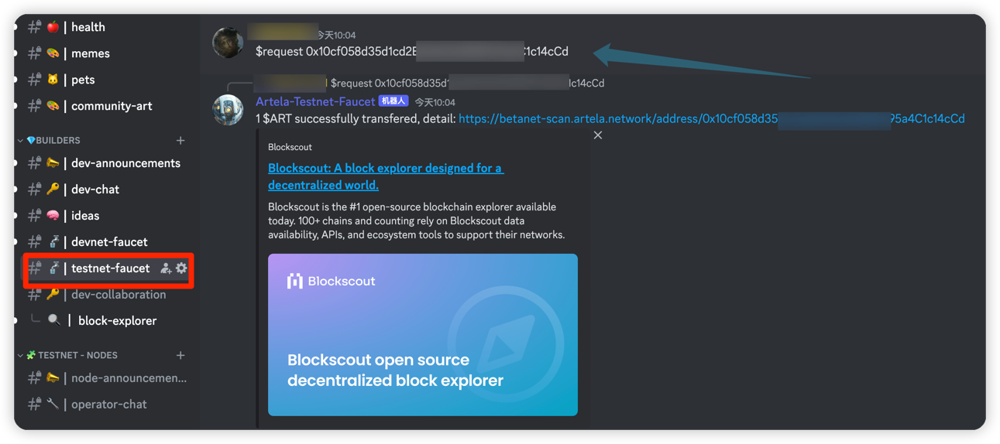
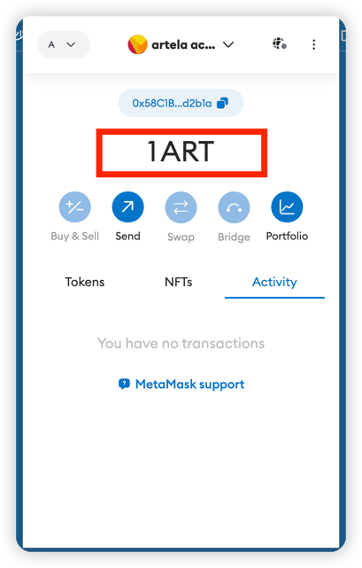

---
sidebar_position：2
---

# 龙头

要获得测试需求的测试令牌，请遵循以下步骤：

*步骤1：加入🚰 [Artela Discord](https://discord.com/invite/artela) 

*步骤2：查找testnet-faucet通道

*步骤3：通过命令获取测试令牌
```shell
    $request {address}
  ```
  

*步骤4：配置metamask检查余额
  

* 