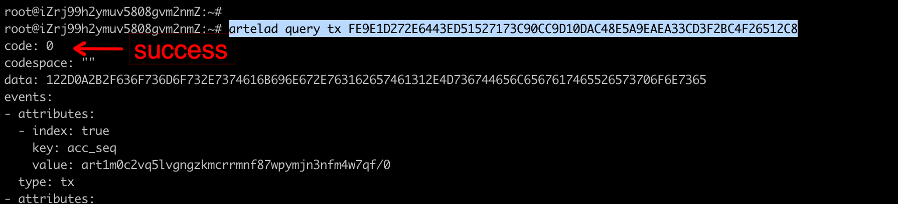
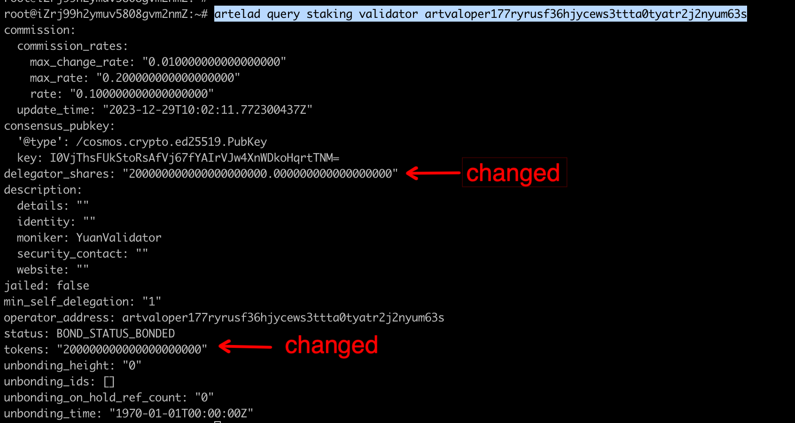
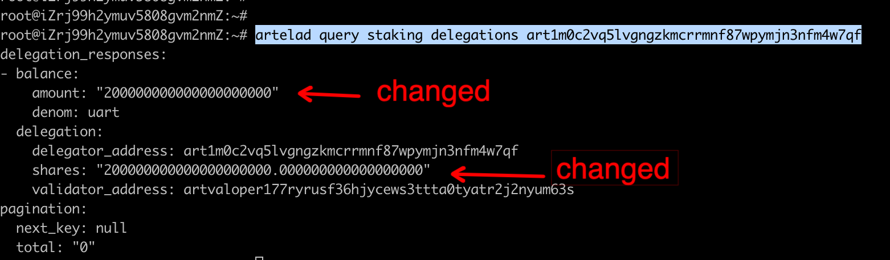
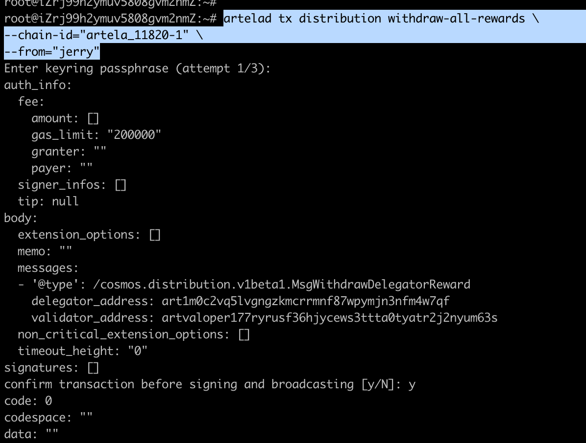

---
sidebar_position：1
---

# 代表们指南

本文档包含了代表们通过命令行界面（CLI）与Artela网络进行交互的所有必要信息。

## 1.加入新的代表们帐户
```bash
artelad keys add <account_name>
```
  

## 2.到验证器
```bash
artelad tx staking delegate <validator_operator> <amount> \
--chain-id=<chain_id> \
--from=<key_name>
```
  

## 3.检查委托TX状态
```bash
artelad query tx <tx_hash>
```
  

## 4.检查验证器的均衡平衡
```bash
artelad query staking validator <validator_operator>
```
  

## 5.快速自我当前代表身份
```bash
artelad query staking delegations <delegator_addr>
```
  

## 6.快速自我奖励
```bash
artelad query distribution rewards <delegator_address> <validator_address>
```
  

## 7.问题目标代表们奖励
```bash
artelad query distribution rewards <delegator_address>
```
  

## 8. INCREASE代表人金额
```bash
artelad tx staking delegate <validator_operator> <amount> \
--chain-id=<chain_id> \
--from=<key_name>
```
  

## 9.确定奖励
```bash
artelad tx distribution withdraw-all-rewards \
  --chain-id=<chain_id> \
--from=<key_name>
```
  

## 10.Redelegate到其他验证器
```bash
artelad tx staking redelegate <srcValidatorAddress> <destValidatorAddress> <amountToRedelegate> 
--from <delegatorKeyName>
```
  

## 11.验证器的undelegate
```bash
artelad tx staking unbond <validatorAddress> <amountToUnbond> --from <delegatorKeyName>
```
  