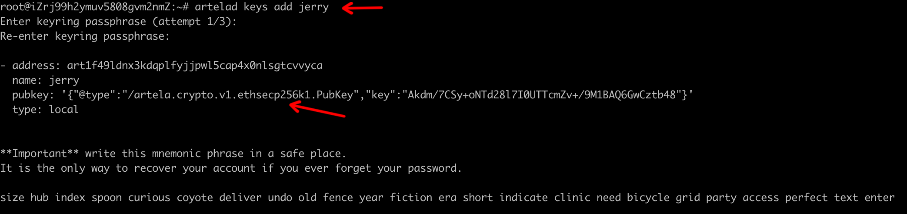
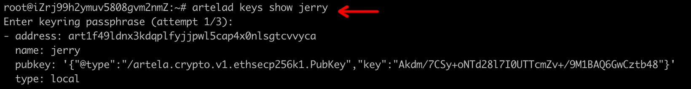
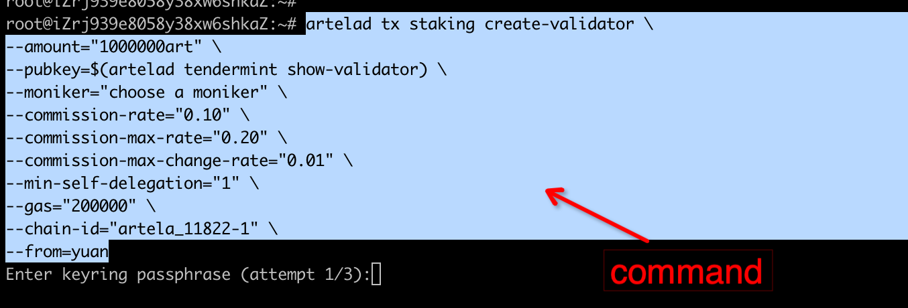
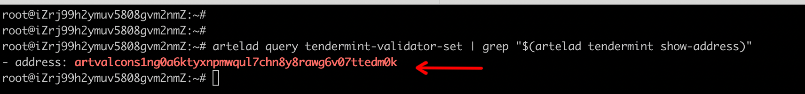

---
sidebar_position：2
---

# 验证器指南

：：：警告
在设置验证器节点之前，请确保已完成 [运行一个完整的节点](../node/run-full-node) 指导。
:::

## 步骤1：创建您的验证器操作员帐户
```bash
artelad keys add <account_name>
```
  

## 步骤2：获取TestNet令牌
您可以从Discord中获得Art Testnet本地令牌。
您可以以这样的方式获得帐户地址：

```bash
artelad keys show <account_name>
```
  

## 步骤3：创建验证器

```bash
artelad tx staking create-validator \
--amount="1000000art" \
--pubkey=$(artelad tendermint show-validator) \
--moniker="choose a moniker" \
--commission-rate="0.10" \
--commission-max-rate="0.20" \
--commission-max-change-rate="0.01" \
--min-self-delegation="1" \
--gas="200000" \
--chain-id=<chain_id> \
--from=<key_name>
```
 ***数量：** 您想自我代表多少艺术。
 ***绰号：** 您的验证器名称，也许是您的团队名称。
 ***佣金率：** 委托您的验证者从代表们那里获得。
 ***从：** 您的验证器运营商帐户名。

  

## 步骤4：确认您的验证器正在运行

如果以下命令返回任何内容，则您的验证器处于活动状态：

```bash
artelad query tendermint-validator-set | grep "$(artelad tendermint show-address)" 
```
  

---

## Appendix

### 1.Query all validators
```bash
Artelad查询Staging验证器
```

！[]（./ img/v17.jpg）

### 2.Query validator through operator address

```bash
ARTELAD查询Staking actaging validator <operator_address>
```

！[]（./ img/v18.jpg）

### 3.Convert bech32(cosmos format) address to hex(evm format) address

```bash
Artelad Debug addr <betch32地址>
```

！[]（./ img/v3.png）

### 4.Convert hex(evm format) address to bech32(cosmos format) address

```bash
Artelad Debug addr <Hex地址>
```

！[]（./ img/v20.jpg）

### 5.Query all local accounts

```bash
Artelad Keys列表
```

！[]（./ img/v4.png）

### 6.Query account through address

```bash
Artelad查询帐户<Coundare_name>
```

！[]（./ img/v7.png）

### 7.Query tx trough tx_hash

```bash
Artelad Query TX <TX_HASH>
```

！[]（./ img/v19.png）

### 8.Unjail validator

```bash
Artelad TX削减Unhakail \
--gas="300000"\ \
--chain-id=<chain_id> \
--from=<account_name>
```

要！


