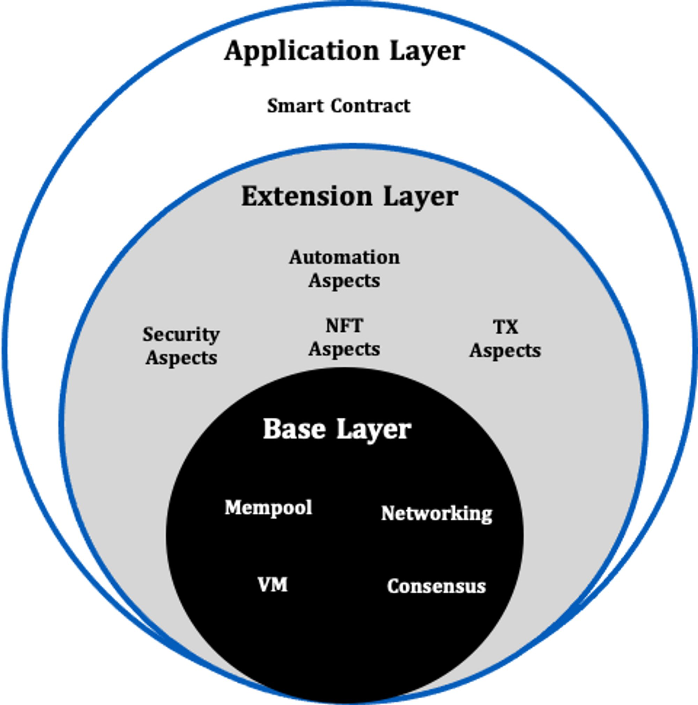

# 概述 

Artela Blockchain 是一个 Layer 1 网络，旨在赋能开发者结合用户定义的本地扩展，开发功能丰富的去中心化应用（dApps）。通过其创新的弹性区块空间设计，它提供了超越 EVM 等价性的高级可扩展性、跨域互操作性和无限扩展性。  
作为第一个整合 Aspects 的 Layer 1 网络，Artela 旨在**最大化这项技术的价值，使开发者能够创建功能丰富的 dApps。**

---

## 架构概述  

- **基础层：** 由 Artela 推出，该层提供基本功能，包括共识引擎、网络、用于执行智能合约的 EVM 环境以及用于执行 Aspect 的 WASM 环境。它构成了网络的核心基础设施。
- **扩展层：** 配备Aspect SDK，该层允许开发人员创建Aspect，可以访问基础层内的所有API，并与智能合约和其他Aspect无缝集成。各个方面与基础层安全隔离，以防止对核心网络的安全性或可用性产生任何影响。
- **应用层：** 在这一层，开发人员可以使用熟悉的工具编写智能合约。最初，提供 EVM 是为了确保加密生态系统中大多数现有 dApp 的轻松采用和集成。

## 核心特征

Artela 致力于成为一个真正无边界的区块链网络：

- **无限扩展性** - EVM 等效但不限于 EVM，支持区块链基础层的本机扩展。
- **无限可组合性** - 完全可定制并与异构模块化堆栈兼容，同时保持网络内的本机互操作性。
- **无限可扩展性** - 通过利用弹性区块空间设计，Artela网络可以容纳大量需要独立区块空间的大型dApp。这样就无需放弃共享安全性来换取可扩展性性能。

## 扩展设计

Artela的扩展架构专为Artela网络的特定需求量身定制，为去中心化应用（dApps）提供增强的可扩展性和可扩展的区块空间，同时确保与其他网络dApps的原生可组合性。
Artela网络内的动态可扩展性由弹性计算支持，主要体现为几个关键技术特性：

- **并行执行：**Artela上的交易可以同时处理。网络根据交易依赖冲突的分析，将交易分组以进行并行处理。
- **弹性计算：**验证节点能够进行横向扩展。网络根据当前的网络负载或需求动态调整验证计算节点。此扩展由弹性协议管理，确保共识网络内保持足够数量的弹性计算节点。
- **弹性块空间：** 利用弹性计算，网络不仅扩展了公共块空间，还允许大规模 dApp 请求专用的弹性块空间，确保量身定制的可扩展性解决方案。

## Learn more

- [EVM++](/main/Artela-Blockchain/EVM++)
- [Aspect 编程](/main/Aspect-Programming/Aspect)
- [并行执行](/main/Artela-Blockchain/Parallel%20execution)
- [弹性块空间](/main/Artela-Blockchain/Elastic%20Block%20Space)
