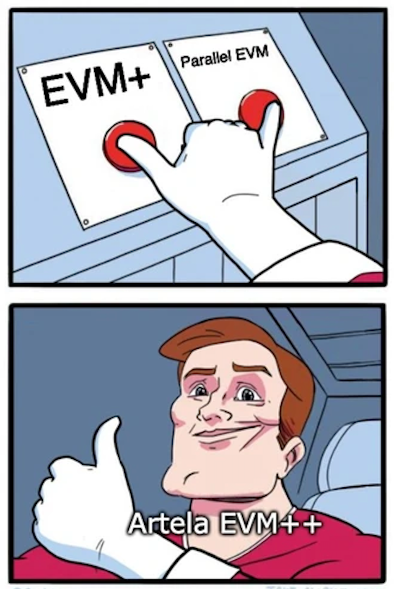
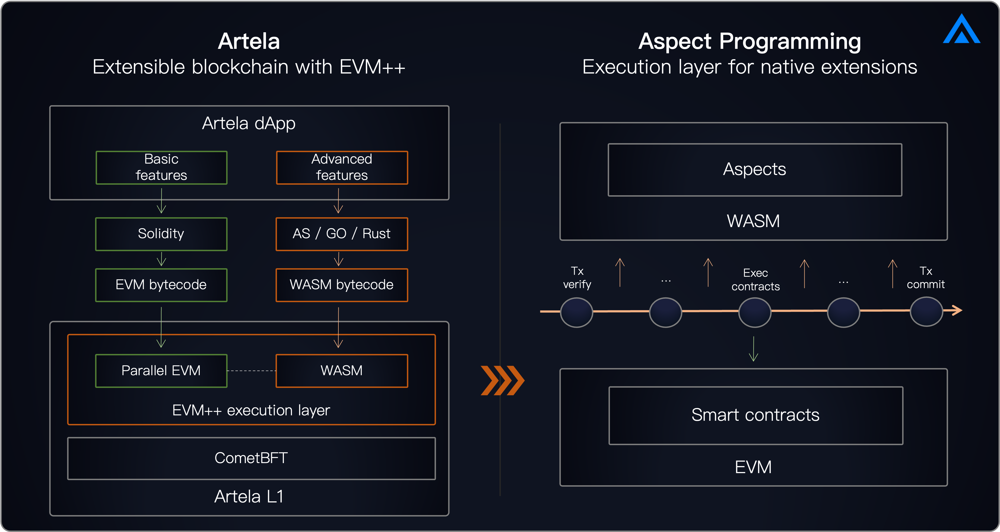

## 介绍

EVM ++是下一代以太坊虚拟机（EVM）执行层。 它通过使用EVM+WASM的本机上链扩展来增强区块链的扩展性，并支持并行执行以确保可扩展的区块链性能。

EVM ++旨在推动传统EVM功能的界限，以适应不断发展的加密世界。 随着Web2的生产力和创新集成，并且随着AI，DEPIN和DEFI安全等技术的整合，EVM ++是EVM资产，协议和基础架构的无缝连接器。 这种集成有助于更广泛地采用加密应用程序，并弥合主流应用程序的差距。

## 通过方面编程解锁可扩展性

EVM ++启用了高度可扩展的EVM网络。 通过将WASM虚拟机集成在EVM兼容网络中，Artela区块链支持动态添加和执行链链扩展程序的执行 [方面编程](/main/Aspect-Programming/Aspect)。 此功能使开发人员可以创建高性能协议，模块化DAPP并为特定方案进行自定义功能。

在DEVNET和公共测试网阶段，Artela的开发人员社区探索了EVM ++的潜力，导致创新用例：

- - Utilizing WASM as an [链上的联合处理器](https://www.odaily.news/en/post/5191903) 为了促进直接在区块链上的AI算法和其他高性能模块的执行，同时确保与EVM系统的无缝互操作性。
- - [链链AI代理](https://github.com/cellulalifegame/Pac-Man-Artela-Aspect) 参与自主世界并启用真正的可编程 [链NPC](https://artela.network/blog/aspect-case-on-chain-npc-for-autonomous-world-game) 可以与用户互动。
- - Opt-in [链上安全](https://artela.network/blog/eliminate-reentrancy-attacks-with-on-chain-runtime-protection) 可以实时执行的模块，允许Defi协议立即识别和恢复可疑交易。

## 通过并行和弹性执行解锁可伸缩性

ARTELA网络超出了基本的并行EVM操作，解决了EVM +方面框架下并行执行的挑战，该框架包括交易生命周期期间在WASM虚拟机上运行的扩展程序。

Artela还通过将并行特征与弹性计算相结合以支持弹性块空间模型来提高网络效率。 该模型允许DAPP优化并行执行的好处。

### **并行执行** 简而言之

Artela的水平可扩展体系结构旨在支持并行执行，从而通过弹性计算来确保网络节点计算功率可扩展，最终实现弹性块空间。

- **并行执行：** 根据交易依赖冲突分析，同时执行ARTEA的交易。
- **弹性计算：** 验证器节点具有水平缩放，根据当前网络负载或需求自动调整计算节点。 弹性协议协调了此过程，以确保共识网络中足够数量的计算节点。
- **弹性块空间：** 利用弹性计算，该网络不仅扩大了公共区块空间，还可以使大规模的DAPP要求专用的弹性块空间。

## 了解更多

- [方面编程](/main/Aspect-Programming/Aspect)
- [预测的乐观执行](/main/Artela-Blockchain/Predictive%20optimistic%20execution)
- [异步预加载](/main/Artela-Blockchain/Async%20preloading)
- [并行存储](/main/Artela-Blockchain/Parallel%20storage)
- [弹性块空间](/main/Artela-Blockchain/Elastic%20Block%20Space)