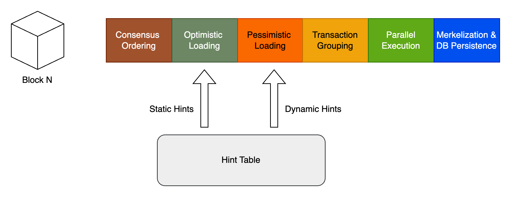

## 介绍

为了最大化CPU的并发计算功能，并防止I/O成为执行瓶颈，我们建议 "Async Preloading"，基于预测算法。 此方法主动预紧事先将事务执行到内存所需的状态，从而消除了交易执行期间I/O访问的需求。

随着过渡到并行交易执行，执行过程中的潜在瓶颈转移到了状态I/O。 块的性能取决于其最慢的批次，这可能会遭受更高的计算需求或扩展 "waiting" 时间，主要来自磁盘，读取帐户和存储插槽。 在Artela中，一种预测算法旨在通过提供相对最佳的解决方案来解决计算瓶颈，而通过异步预加载和提示表来减轻I/O延迟，从而提高了整体系统性能。 下图说明了异步预加载的工作过程。

在执行每笔交易之前，**乐观的预加载** 启动，仅根据静态提示将指定的存储器加载到内存中。 遵循乐观的预加载，**悲观的预加载** 开始，根据动态提示将所有潜在存储加载到内存中。

完成异步预加载后，将所有必要的状态存储加载到内存中。 随后的执行将完全基于内存，预计将增强I/O性能的一倍 **10至1000次**.

### 乐观的预加载

当在单个块中建立交易订单时，乐观的预加载评估智能合约的基本键值（KV），并使用静态提示预加载存储插槽。 此预加载过程不必等待交易执行，并且可以异步进行。 目的是通过确保易于访问必要的数据来最大程度地降低每批的I/O成本。 但是，重要的是要注意，虽然乐观的预加载负载负载所有所需的存储插槽，但可能会错过。 这些错过将通过悲观的预加载来解决。

### 悲观的预加载

在完成乐观的预加载后，悲观的预加载采用概率模型来预测即将进行的交易中可能需要哪些键值对。 通过动态提示来支持该预测，使用方法签名并调用数据来估计潜在的读/写入集。 尽管这些预测可能有时会高估所需的数据 - 交易终止或其他因素的交易，该策略旨在通过抢先利用其他I/O资源来减少每批的执行时间。