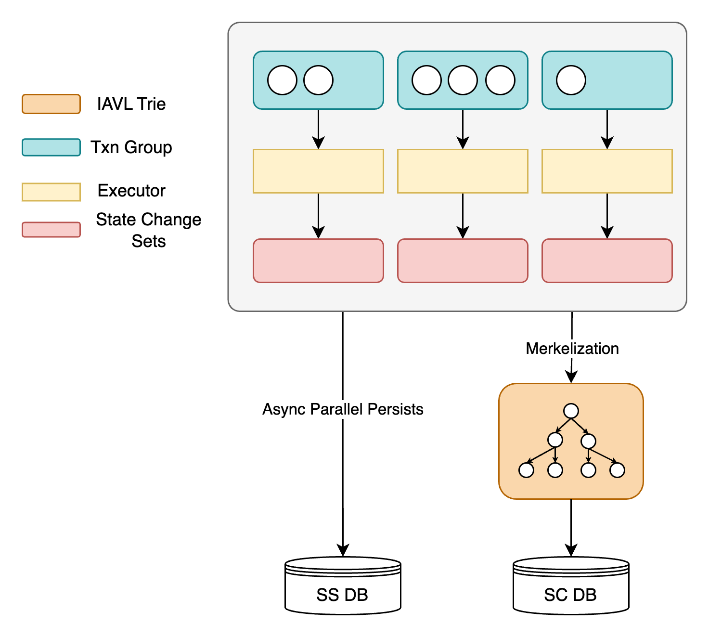
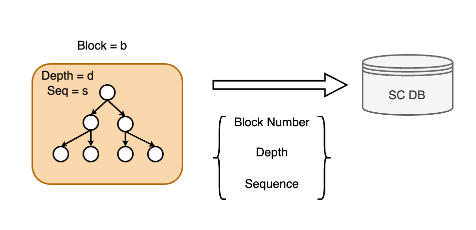
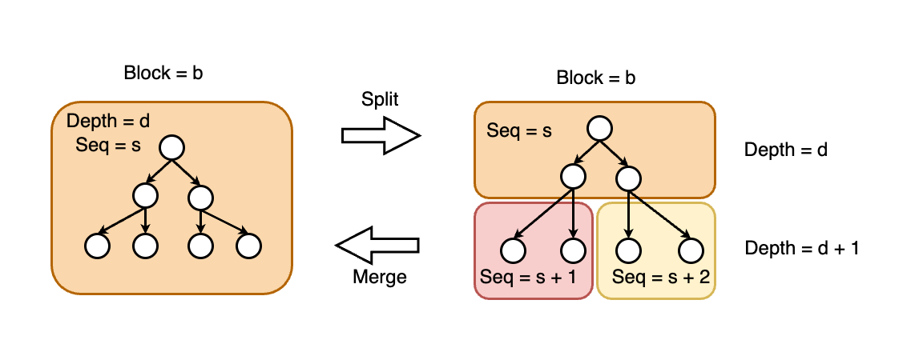

## 介绍

该平行存储旨在解决区块链执行中遇到的最后两个性能挑战：启用可行的存储，并提高持续的Merkelized World State在数据库中持续存在的效率。 通过并行化存储，它与并行的执行功能保持一致，从而有效利用多核处理优势。 随着历史数据的积累，存储层面临与写入和压实有关的不断升级的问题，这可能会大大降低Merkelization的性能。

当交易并行执行时，将有效利用多核处理。 但是，如果数据持久性落后于交易执行，则存储将成为瓶颈，阻碍区块链性能。 可行的可行存储对于最大化交易并行执行效率至关重要。

Merkelization的性能与将基于Merkle树的世界状态写入数据库的吞吐量和延迟有关。 主要问题是写入放大和数据库性能。 每个状态修改都要求默克尔树重新编写并从叶子节点重写KV数据库中的根。 KV数据库本身也经历了写入放大，从而导致了大量的开销。 随着数据的积累，默克尔树的深度增加，从而导致编写更多的键值对。 这加剧了数据库背景活动，例如压实，这些活动消耗了大量磁盘和CPU资源。 因此，写作世界国家的吞吐量和表现巨大降级。

并行存储是一种专门设计的优化存储解决方案，可提高Cosmos SDK中状态存储的效率。 该层的制作是为了确保与已建立的宇宙存储框架（例如LevelDB或RockSDB）以及IAVL Trie无缝兼容。 值得注意的是，随着区块链状态的扩展，现有的宇宙IAVL存储的实现会降低性能。

该层通过优化I/O性能来解决这些挑战，以进行广泛的状态操作并加快默克尔化过程。 它旨在通过一系列关键增强来纠正普遍的存储效率低下：

1. 国家承诺（SC）和国家存储（SS）的分离
2. K-Persist国家承诺数据库

### 国家承诺和国家存储的分离

为了实现可行的存储，我们已经在 "State Commitment" （SC）和 "State Storage" （SS）。 这种方法使我们能够将操作明确地分类为可行的和不可行的细分市场，从而增强系统吞吐量和效率。

存储架构的组织如下（如下图所示）：

- SS DB是可行的，允许异步IO。 它存储元信息，例如帐户和存储插槽，但没有保留任何TRIE数据。 这种方法可以防止数据冗余并优化空间利用率。
- SC DB是串行的，并使用同步IO。 它记录所有TRIE信息。 在这里，叶节点仅保留帐户和存储插槽的哈希信息，避免元信息以避免冗余和流线存储。

该设计的操作如下：

- 一旦通过并行化标准将交易分组后，异步预加载机制会触发并行异步读取操作与SS DB。 这旨在最大化磁盘IOPS和带宽。
- 一旦执行事务组完成，每个执行组的结果将直接写入磁盘。
- 磁盘编写操作和Merkelization过程同时运行而不会干扰。 前者利用I/O资源，而后者取决于CPU资源。 在此阶段，修改集将转移到SC DB中以获得状态根并生成块标头。

为了减少压实和提高默克尔化的性能，SS DB的存储由四个数据库实例组成：

- **索引DB：** 该数据库映射链条上的新地址，将20字节的地址转换为5字节序列以压缩空间，尤其是在支持前缀压缩的RockSDB/LevelDB等数据库中。 新创建的地址（可能在链上活跃）以大型序列编码。 这种定位有助于有效查询，因为较大的序列位于数据库文件的顶部。
- **帐户DB：** 记录从序列到帐户的信息，其中序列是在大型中编码的。
- **ContractDB：** 跟踪从序列 +存储插槽到存储插槽值的信息。
- **写设置DB（可选）：** 考虑到网络中验证器和完整节点的不同作用（validators侧重于共识和交易执行，而完整的节点都提供RPC服务），例如SPV和State Sync（例如SPV和State Sync）需要对Writeset DB中每个块的修改进行额外登录。

由于传统的LSM数据库设计中的压实，这种体系结构有效地减少了冲突和资源浪费，从而提高了交易执行效率超过60％，如基准测试所示。

### K-Persist SC数据库

以下提案概述了一个通用持久数据库设计，该设计支持更有效的Merkelization以及多次数据和SPV查询的能力，而不会损害哈希的兼容性。

主要思想是将默克尔树的多个小型节点汇总到一个较大的节点中以持续，缩短IO路径，减少写入放大并减少空间使用情况。 此外，这种方法利用磁盘特性来实现高性能读写操作。 这种类型的持续节点称为k层节点。 它借鉴了BW-Tree的设计原则，以优化世界国家持久性的效率。 这涉及批处理更新和延期写入，将多个小写操作结合到一个较大的写作操作中，从而降低了写入数量并提高写入效率。

与16-艾尔克尔·帕特里夏（MPT）或稀疏的默克尔树（SMT）相比，诸如IAVL之类的二进制结构表现出重大的读写和写入扩增问题。 与16棵树相反的二元树的更深逻辑深度会导致更频繁的磁盘I/O操作，这可能会成为Merkelization期间的关键问题。

区块链系统中二进制或什至16-元的默克尔树的次优性能显着是由于频繁的磁盘访问，这增加了读取操作的成本，从而在执行层中创建瓶颈。 这个问题还构成了并行EVM和Merkelization过程的主要缺点之一。

考虑到传统硬盘扇区通常是512个字节，但是现代驱动器（尤其是固态驱动器（SSD））的扇形大小为4KB，我们可以利用这一特征来提高效率。 鉴于区块链上下文中的默克尔树通常很少，因此调整参数$ k $是可行的，以便将$ 2^k $节点压缩到一个最小的读/写单元中，最佳地左右3-4kb。

为了最大化磁盘和I/O资源利用率，每个$ K $ -Layer读取/写操作的设计如下：

1. **加载根节点：** 基于块号，加载世界状态根rest rest的根节点。
2. **Merkelization过程：** 如果有必要进行默克化，请根据写入集加载相应的默克尔路径的内部和叶子节点。
3. **节点更新：** 从底部向上更新沿Merkel路径的叶子节点，以计算新的根哈希值。 将此节点标记为脏，并将沿默克尔路径的相应$ k $ layer节点标记为脏节点。
4. **$ k $ -layer节点的持久性：** 计算哈希值后，所有$ k $ layer节点持续存在。 传统的默克尔节点的主要瓶颈在于其索引信息是哈希值，在LSM数据库中的性能很差。 为了避免这种情况，我们使用以下编码方案记录所有$ k $ layer节点：
$$
B + D + S = K
$$

在这种情况下，$ b $代表块号，$ d $表示$ k $  -  layer节点的深度，$ s $表示序列号，而$ k $是编码的密钥。 所有数字均以大型格式存储，以确保与压实过程的兼容性。

深度是指$ k $ layer节点的深度，序列是一个增量唯一索引，如下图所示，$ k $ layer节点的布局显示为$ k $ layer节点。

为了更好地描述$ k $ layer节点之间的亲子关系，灵感来自RockSDB和InnoDB等传统数据库系统，我们在每个父母的$ k $ layer节点中记录以下细节 节点（最高$ 2^k $节点）：

1. **版本：** 每个孩子上次修改时的$ k $ layer节点的版本值。
2. **序列编号：** 每个子节点的唯一标识符。
3. **启动密钥和结束密钥：** 这些键定义了每个子节点覆盖的数据范围。

虽然像IAVL一样，典型的搜索树固有地包含每个节点内的启动密钥和终止密钥信息，但K-Persist SC数据库旨在解决其持久性挑战。 因此，当选择$ k $相对较大时，存在一个潜在的情况，其中$ 2^k $节点超过了4KB扇区尺寸限制，升级为40kb甚至400kb之类的尺寸。 这样的尺寸将使阅读作品的操作降低效率。

为了解决这一难题，我们可能会采用分裂和合并设计策略（如下图所示）。 这将使我们可以将一个大的$ k $ layer节点分为多个较小的$ k $ layer节点，反之亦然。 重要的是要注意：

- **深度一致性：** 拆分$ k $  - 层的节点仍然保留原始的深度$ d $，因为每个节点的定义中的值$ k $保持不变。
- **节点设计：**$ k $ layer节点的结构类似于MySQL的InnoDB中看到的设计，该设计是B+树的一部分。 这意味着像InnoDB一样，我们的设计涉及自下而上的施工过程，但是根据我们的特定上下文，以管理基于Merkel的区块链数据的复杂性。

通过集成这种自适应分配和合并能力，K-Persist SC DB可以动态地适应其存储数据的尺寸要求，从而有效地利用存储空间并保持最佳性能，即使在不同的负载条件下也是如此。 这种方法不仅增强了数据库的灵活性，而且还确保可扩展性和效率在处理大型区块链数据方面。