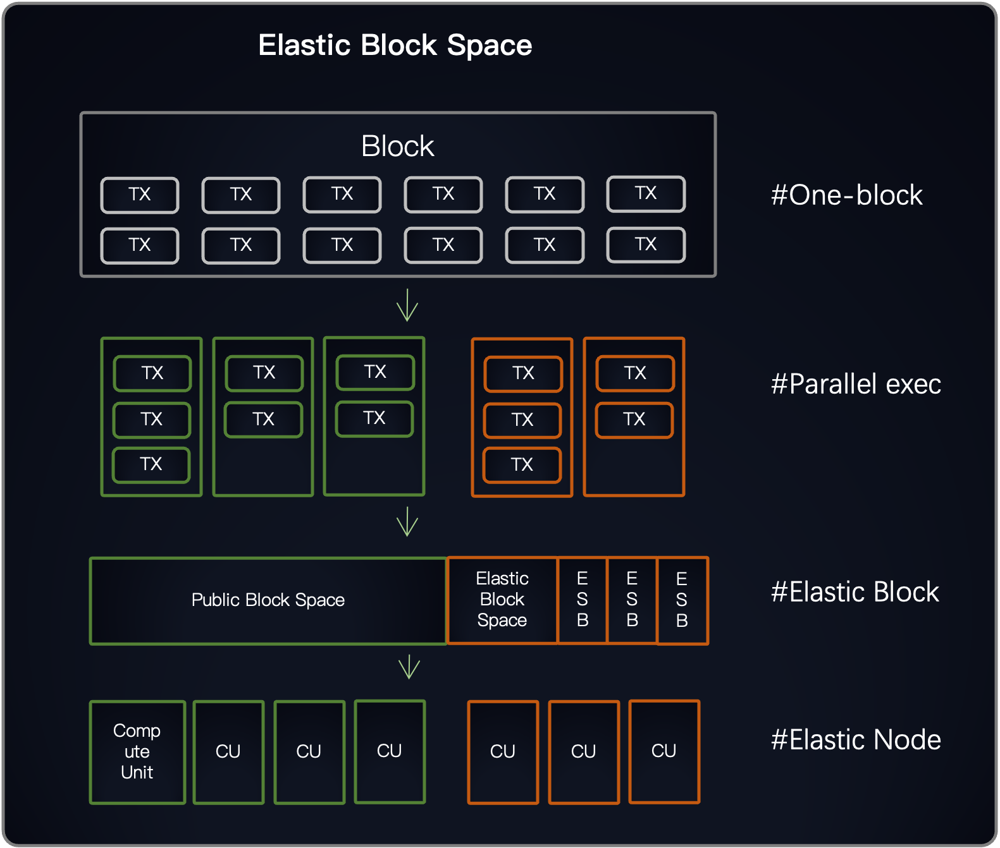

## 介绍

该提案描述了实施一个综合策略 **弹性块空间** （EBS）在Artela区块链生态系统中的系统。 EBS是指动态可扩展的块空间，该空间为具有高交易吞吐量需求的DAPP提供独立和协议保证的块空间，从而确保可预测的性能。 通过引入EBS，Artela努力克服固定块空间容量的约束，从而实现无缝的可扩展性，同时保持可预测的性能和有效的资源利用。

通常，单片区块链或执行层只有一个共享的块空间可用于所有DAPP，这可能会导致不同的DAPP之间的竞争，从而导致不可预测的气体费用和性能。 对于流量较高和大量链上互动的DAPP，块空间的竞争极大地损害了用户体验。 选择应用程序链或汇总以获得独立的块空间会带来巨大的发展负担和合成性的丧失。 在Artela中，EB提供了解决这一困境的解决方案。 当DAPP需要更多的性能可预测性时，它可以适用于专用的块空间。 此额外的空间集成到块中，仅用于DAPP的交易。 随着块空间的增加，验证器必须扩展 "up" 通过添加弹性执行节点来处理增强的处理负载。

弹性区块空间是一个关键的区块链缩放机制，在确保互操作性的同时促进了无限的可伸缩性。 与其他可扩展网络（例如碎片区块链，应用链网络和第2层解决方案）不同，这些解决方案提供了独立的区块空间，但遭受了隔离和非同步块的产生 - 弹性块空间可实现具有专用块空间的DAPP，从 相同的块，规避异步跨链通信的复杂性。

当Artela网络中的DAPP要求高可扩展性时，它可以订阅弹性块空间以管理交易量的增加。 该功能与天然扩展相结合，在Artela上授予DAPP，从而增强了可扩展性和自定义潜力。

### 块空间类型

**公共街区空间。** 传统上，区块链块受到固定的公共区块（PBS）容量的限制。 PBS内的交易必须使用气体费用来争夺块空间，这可能导致高网络活动期间的交通拥堵和交易费用增加。

**弹性块空间。** 弹性块空间引入了动态块空间分配机制，使DAPP在必要时请求专用的块空间。 此额外的空间无缝集成到块中，并专门为请求DAPP的交易保留。

### 弹性块空间

当Artela网络中的DAPP需要高可扩展性时，它可以选择弹性块空间来管理交易量的增加。

弹性块空间为DAPP提供了针对其交易吞吐量要求的专用和协议保证的块空间。 这种机制赋予了几个关键优势：

- **订阅模型：** DAPP可以签署交易以动态订阅弹性块空间服务。 此实现使DAPP可以利用链级独立区块空间，而无需与区块链基础架构相关的任何其他开发。
- **独立块空间：** DAPP可以要求额外的块空间来容纳高度交易量，该量专门用于其自身使用。 通过添加弹性执行节点来管理增强负载来扩展验证器。 独立的块空间受气体的限制，但通过执行时间衡量； 合同可以实现的更好的并行化，该块空间将拥有的较大气体限制。
- **互操作性：** 与碎片区块链或应用程序链网络相反，这些网络通常会遇到异步跨链通信的挑战，弹性块空间可以通过同一块中的原子交易实现同步交互。 这样可以确保在同一区块链中运行的DAPP的无缝集成和本地合并性。

### 弹性节点

Artela的验证器节点是作为弹性群集构成的，通过根据需要添加或去除执行节点来支持动态缩放。 每个EB都将分配专用CU来执行其交易。 该集群体系结构的基础是以下核心概念：

- **计算单元（CU）：** 这是具有固定数量的CPU内核的基本执行模块，能够并行计算，可预测的交易处理吞吐量（TPS）。 每个CU可以管理多个并行执行组。
- **基本CUS：** 这些构成了Artela验证器节点的最小配置，可确保网络的基线水平。
- **逐步缩放：** 网络可以通过基于平均负载添加或删除CU来动态扩展。 例如，如果负载超过当前容量的125％，则可以提出提案以增加CUS的数量。 一旦提案获得批准，网络就可以扩大规模并减少开销。 相反，如果负载降至25％以下，也可以提出减少CUS的建议。 扩展决定受节点之间共识的约束。
- **订阅规模：** 作为逐步缩放的补充，也可以在EBS订阅时动态缩放CU。 当订阅新的EBS时，将分配专用CU来执行给定EBS内的交易。

### EBS的可预测性能

Artela的 **弹性块空间** 通过提供根据需求扩展的专用块空间和弹性计算能力来确保分散应用程序（DAPP）的可预测性能。 以太坊最初提出的气体机制是衡量智能合约资源消耗的一种创新方式，可以通过以下等式表示：

$$
g \ equiv c（x） + m（y） + s（z）
$$

在这里，$ g $代表汽油成本，$ c $表示CPU时间的转换功能，$ m $表示存储器使用的转换功能，$ s $代表用于存储使用的转换功能 。

但是，此方法不适用于启用并行执行的EB。 对于EBS +并行执行，将应用新的测量模型，即：

$$
t_ \ text {pbs} \ equiv f（g_ \ text {pbs}）
$$

$$
g_ \ text {ebs} \ equiv g（t_ \ text {pbs} \ times p）
$$

$ g_ \ text {ebs} $表示EBS的气体限制。 函数$ f $将将PBS（$ g_ \ text {pbs} $）的气体限制转换为执行时间$ t_ \ text {pbs} $，乘以给定DAPP $ p $的并行性以获取最大值 允许执行此EBS。 之后，通过应用转换功能$ g $，给定的执行时间将转换为EBS的气体限制。

最初，无法确定给定DAPP的平行$ p $，因此初始$ g_ \ text {ebs} $将设置为固定值$ t_ \ text {block} / 1000000 $（假设CPU执行1秒 等于1000万天气，与以太坊的假设相同。 此值是针对最坏情况的，这意味着如果完全无法平行执行DAPP，则至少EBS可以具有如此多的气体限制（而不会影响整个块的执行时间）。 随着更多交易的执行，平行性$ P $将得到更好的估计。 $ p $的估计将由以下等式确定：

$$
u \ equiv g_ \ text {hester} / g_ \ text {ebs}
$$

$$
i \ equiv（t_ \ text {pbs}  -  t_ \ text {ebs}） / t_ \ text {pbs} \ times u
$$

$$
p_ \ text {new} \ equiv p_ \ text {old} *（1 + i）
$$

在这里，$ u $表示EBS的使用级别。 $ i $代表从最后一个区块中的平行性变化，这是根据PBS和EBS之间的执行时间差异计算出的，其气体使用水平适用于与块的并行性相对准确的变化。 通过不断调整并行性参数，EB的气体极限可以收敛到最佳值，从而使其执行时间更可预测并最大化CU的计算功率使用情况。

### 治理和缩放

弹性块空间的操作框架依赖于治理机制和动态缩放策略，旨在优化资源分配和确保网络效率。 为了确保在协议级别上弹性块空间的资源可伸缩性，将采用以下方法：

- **放入缩放：** 访问虚拟块空间需要DAPP存储特定数量的令牌。 此操作启动了节点扩展，从而为DAPP的智能合约提供了专门的资源。 具有低入口壁垒的拍卖机制可确保资源的公平访问和分配。
- **动态节点管理：** 弹性节点体系结构有助于动态缩放，该缩放受网络共识协议约束。 该机制使验证者能够根据实时需求来扩大或向下扩展资源，从而维护最佳性能和资源利用。

总而言之，Artela的弹性区块空间和弹性群集为可扩展和可预测的区块链性能提供了强大的框架，从而确保DAPP可以有效，有效地运行，而与交易量无关。 这种创新的方法将动态缩放与专用资源相结合，为区块链应用的不断发展的需求提供了灵活而有效的解决方案。