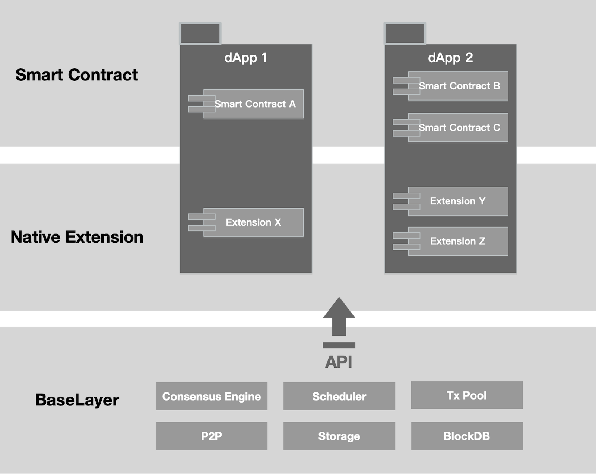

# Native Extension

<!-- ## What is Native Extension -->

Native Extension 是可编程的链上模块，用于定制功能。它从基础层扩展，并与区块链智能合约协同工作，允许以即插即用的模块化方式构建 dApp。

Native Extension 是区块链定制功能的解决方案。

---

##为什么我们需要原生扩展

为了满足不同用例的定制需求，功能性已被确定为需要解决的重大挑战。鉴于此，有人提出了引入新“层”的想法：

> L2 用于扩展，L3 用于定制功能，例如隐私。在这个愿景中，没有尝试提供“可扩展性的平方”；相反，堆栈中有一层可帮助应用程序扩展，然后根据不同用例的定制功能需求将各层分开。——Vitalik Buterin

根据 Vitalik 对以太坊的愿景，某种满足非扩展需求的“层”显然将发挥重要作用。他的 [帖子](https://vitalik.ca/general/2022/09/17/layer_3.html) 强调了区块链网络支持“定制功能”的必要性。

以太坊虚拟机 (EVM) 作为支持智能合约的执行引擎，是构建 dApp 以实现功能的主流模型。EVM 最初由以太坊提供，现在已被众多智能合约链采用，通常称为 EVM 兼容链或 EVM 等效链。然而，当前的 EVM 在支持广泛的 dApp 功能方面已被证明是有限的。关键挑战在于突破 EVM 链内功能的界限。

学术界为其实现提供了线索：

> 功能和可扩展性是指区块链实现支持复杂行为的能力：作为内置功能或通过扩展机制，允许开发人员制作超出平台初衷的应用程序。

Native Extension 是最佳解决方案，具有平衡的 EVM 等效内置功能和 WASM 模块化扩展的扩展机制。

## DApps with Native Extension

 
 

**智能合约**

运行在EVM基础层上，无需第三方干预即可进行可信交易的计算机协议。开发者可以使用智能合约来实现dApp的基本业务逻辑。

 

**原生扩展：**

运行在 WASM 扩展层上的模块化组件，通过基础层 API 实现高度定制的功能。开发者可以使用原生扩展来实现额外的自定义逻辑，从而精细化整个交易生命周期。

> 基础层 API：区块链基础层向扩展层暴露的一组 API。基础层是区块链网络、共识、存储等处理模块的集合。基础层 API 实现了扩展层基础模块的定制。

每个智能合约都可以根据具体需求搭配不同的原生扩展。原生扩展也可以作为公共服务共享，降低 dApp 构建门槛，造福整个生态系统。

## Native Extension 如何让 dApp 受益

定制化功能、模块化、可组合性是 Native Extension 追求的目标。

**可扩展性和定制化功能**

Native Extension 的可扩展性允许在原子级别实现内置定制功能。智能合约与 Native Extension 的结合为 dApp 提供了灵活的可扩展性。

**独立的 dApp**

向底层区块链添加全局功能需要较长的开发和验证周期。使用 Native Extension，dApp 可以以模块化的方式扩展功能，而无需对网络节点进行全局升级。

**可重用的公共服务**

Native Extension 可以作为公共服务发布并集成到 dApp 构建中。它减少了代码冗余，增强了软件模块化，并提高了软件安全性。

**易于维护**

Native Extension 不需要更改智能合约代码。DApp 将不再是紧密耦合的代码库的集合。
