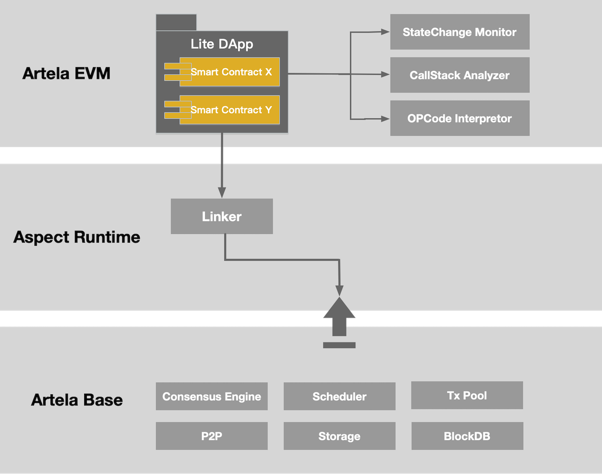
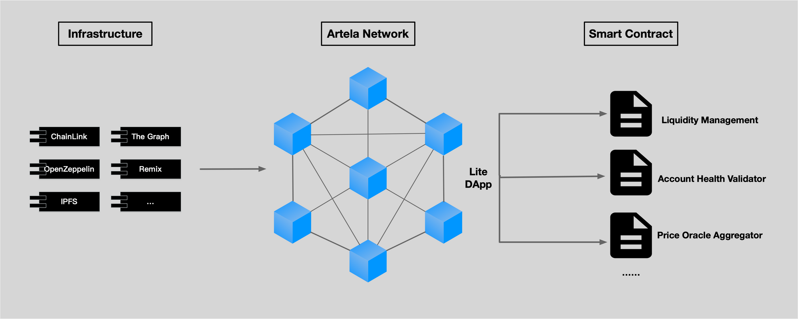

# Lite dApp

## 简介

> **Lite dApp 是以与以前相同的方式构建的智能合约。**

Lite dApp 和在 EVM 区块链上运行的 dApp 之间没有区别。Artela 有一个用于智能合约的 EVM 执行层。在 Artela Network 上构建 Lite dApp 的方式与在以太坊上构建智能合约 dApp 的方式相同。

Aspect 作为模块化扩展模块，是 dApp 构建的最佳选择。开发人员可以像以前一样构建智能合约，而无需扩展。

Lite dApp 的原理：

---

## 用例

1. 智能合约 PaaS
   
    Artela Network 将智能合约工具集成为内置选项，使智能合约开发尽可能简单。Artela 提供平台即服务 (PaaS) 来帮助开发人员构建智能合约。

1. 需要弹性区块空间的智能合约
   
    对于需要高可扩展性的 DeFi 智能合约，可以利用弹性区块空间来实现无限的可扩展性。