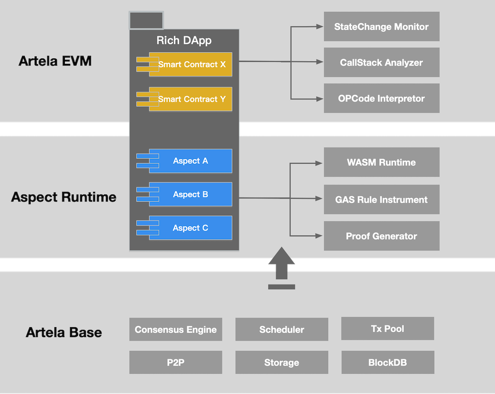
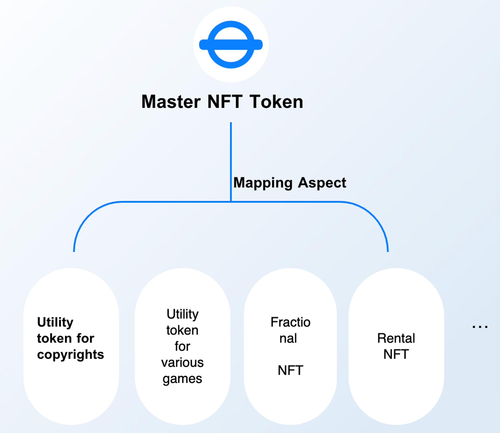
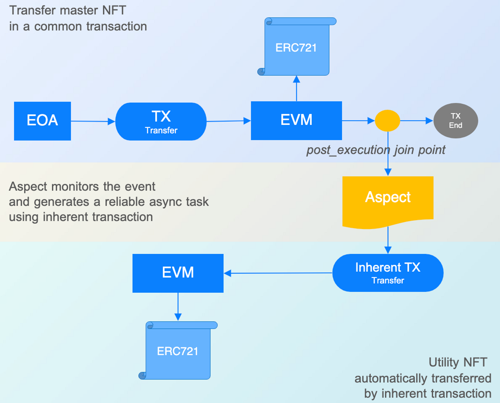
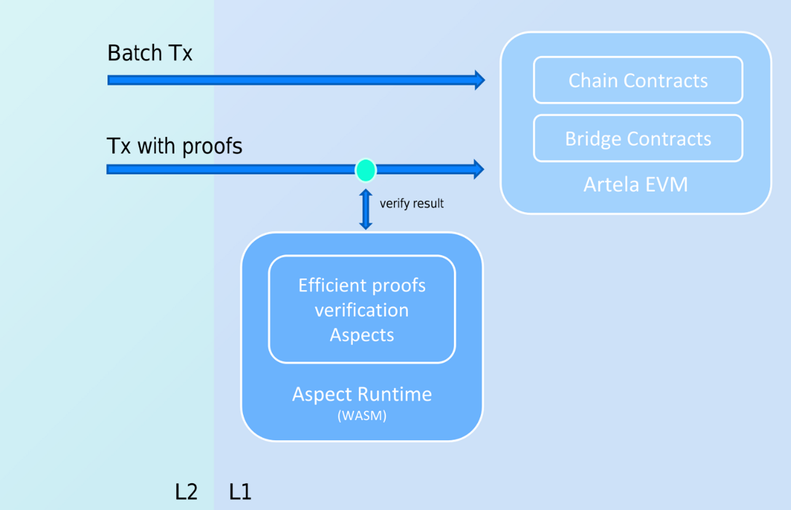

# Rich dApp

## 简介

> **Rich dApp 由智能合约和 Aspect 组成。与 Lite dApp 相比，它支持自定义功能。**

Rich dApp 通过结合使用智能合约和 Aspect 来整合特定于应用程序的功能。开发人员可以在智能合约中实现基本逻辑，在 Aspect 中实现附加功能，从而实现超越 EVM 等效性的功能丰富的 dApp。智能合约在 EVM 环境中执行。Aspect 在 WASM 环境中执行。

以模块化的方式，DApp 不再是单一的、紧密耦合的代码库。只需组装 Aspect，即可实现灵活性、可重用性和可扩展性的显著改进。

Rich dApp 的原理：

<!-- 

 -->

---

## 用例

<!-- 1. High-Performance Orderbook
    

    Aspect 使高性能全链订单簿成为可能，释放 DEX 潜力。
    
    通过将多个 Aspect 绑定到单个智能合约，可以在一个 CLOB 内同时实现匿名性和各种合规性要求。
    
    Aspect 可以为智能合约预处理交易。定制的匹配引擎实现了比智能合约更强大的功能。

 -->

1. 实用型 NFT 映射

   通过 Aspect，NFT 可以映射到其他实用型 NFT 代币中，以满足特定场景的需求并实现可编程。

  

  实施方面旨在监控 NFT 的全局状态并管理主 NFT 和实用 NFT 之间的关系。主 NFT 无需抵押即可生成实用 NFT。流动性和实用性之间的平衡可以得到优化。

  
      
如果没有 Aspect，原始的 NFT 代币标准必须分叉才能支持这样的结构化 NFT；一旦某些 NFT 的结构最终确定，除非重新部署，否则将没有修改的余地。

有了 Aspect，NFT 可以保持其原始状态，同时实现前所未有的灵活性、可编程性和可组合性。

2. 通过 Aspect 实现高效的 Rollup

在 EVM 上有效验证 Rollup 证明的严重限制：

    - 对于 OP：一些合约的字节码大小膨胀，需要更多的 gas
    - 对于 ZK：修复配对曲线和哈希算法

Aspect 使证明验证更容易实现。开发者可以在 Aspect 中运行链下核心协议和证明验证。

    - 对于 OP：可以构建“evm-in-wasm”模式，实现有效的单轮非交互式证明。
    - 对于 ZK：可以在 Aspect 中实现各种配对曲线和哈希算法。

<!-- 

 -->

 