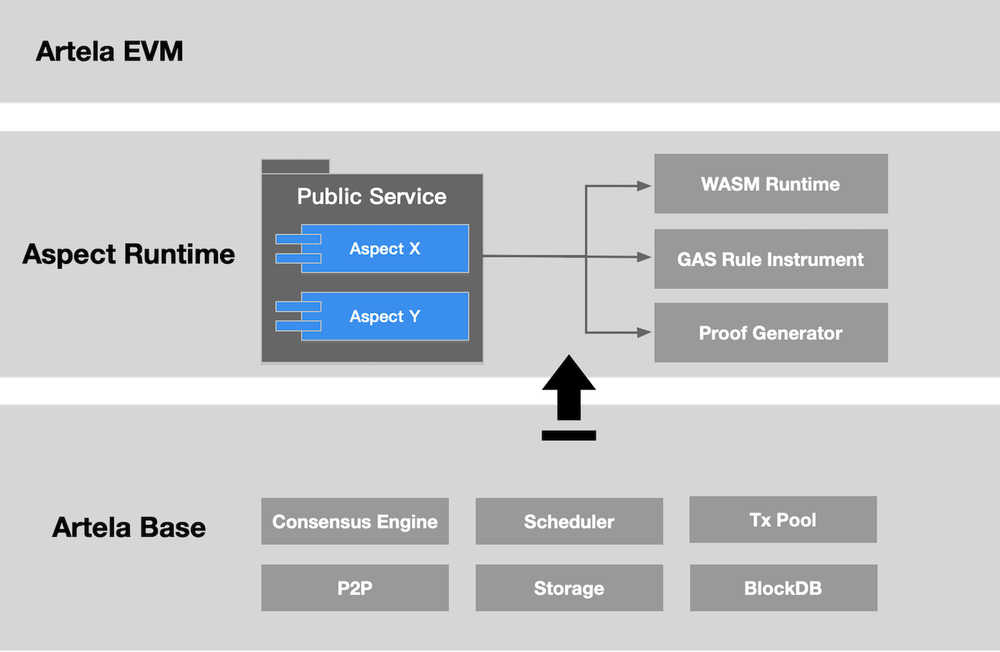
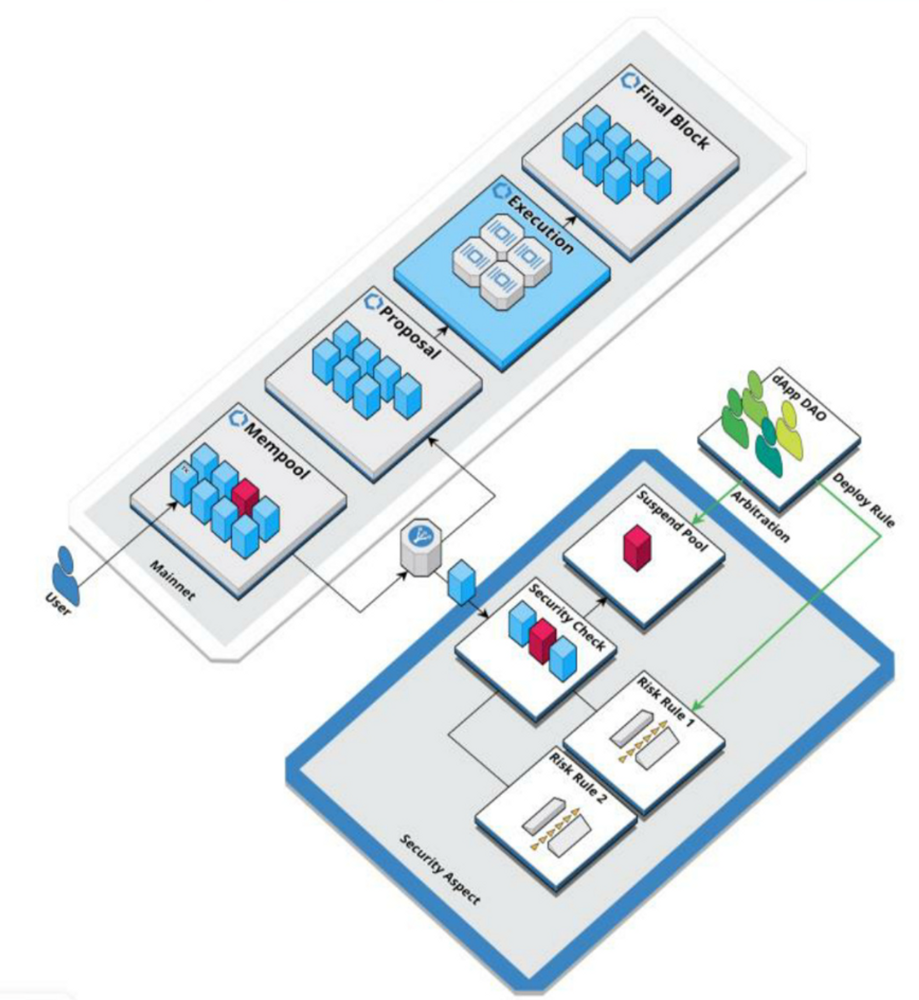
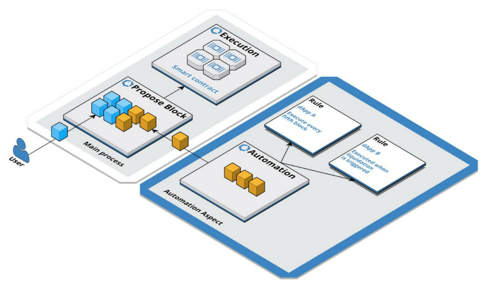

# Public Service

## 简介

> **Aspect 可以作为公共服务提供，通过多功能智能合约直接从其使用中获得价值。**

从公共产品开发者的角度来看，他们可以将公共产品构建为 Aspect，并直接从其使用中获得价值。当 dApp 与公共产品 Aspect 交互时，它们会产生使用量。作为奖励，公共产品开发者有资格根据经济激励模型从 Artela 生态系统获得代币。

从应用程序开发者的角度来看，他们只需集成公共服务 Aspect 即可构建他们的 dApp，从而大大降低成本并提高效率。

随着更多公共服务 Aspect 的开发，开发者和生态系统都将从中受益。

公共服务的原则：

<!-- 

 -->
 

---

## 使用案例

1. 企业级链上风险管理

Artela 通过 Security Aspect 实现实时链上风险控制。如果没有 Aspect，当前的审计等解决方案都是外围的链下风险管理。

企业级风险控制逻辑可以通过 Security Aspects 部署在链上。当交易触发风险控制策略时，Aspects 可以及时识别并暂停有风险的交易。

Security Aspects 可以灵活地插入/拔出并与 dApp 结合。

<!-- 

 -->
 

2. 链上自动化中间件服务

Aspect 可以作为中间件部署，以实现可靠的链上自动化执行。

目前，自动化执行只能由链下实体实现，可能存在可组合性和信任等权衡。

自动化 Aspect 作为基础层的扩展运行，以保持本机级可组合性，并可由共享验证器集支持。 它为 DeFi 解锁了更多可能性，例如 JIT LP、交易性能保护、交易逆转、dApp 可提取价值等。

<!-- 

 -->

